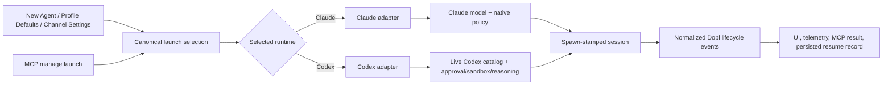

# Codex Runtime Parity and Launch Reliability

> # ⚠ START HERE — CODEX COLD LAUNCH WORKS; RELEASE GATES REMAIN (2026-09-22)
>
> **This plan is PARTLY IMPLEMENTED.** The modern app-server cold-launch path now completes a
> real turn against the ChatGPT-bundled Codex alpha, while the shared runtime/model/settings work
> from the prior pass remains intact. **Read
> [Implementation Log](#implementation-log) and [Handoff](#handoff--what-to-do-next) before writing
> any code, or you will rebuild finished work.**
>
> | | |
> |---|---|
> | **Implemented this pass** | Current thread/turn/steer/interrupt/usage shapes; isolated `CODEX_HOME`; method-valid approval responses; runtime-owned credential preflight; stale cross-runtime model guard; downgrade runtime mirror |
> | **Still release-blocking** | Supported standalone CLI/distribution decision; measured committed fixture + version pin; packaged Finder smoke; live Dopl-MCP approval/audit; Codex resume semantics; migration application; mixed-runtime release matrix |
> | **Branch** | `codex/codex-runtime-parity` in the isolated `codex-runtime-parity` worktree; not yet merged into the user's dirty main checkout |
> | **Migration** | **1 written, NOT APPLIED** — `supabase/migrations/20261017120000_channel_launch_directives_runtime.sql` |
> | **Green** | desktop **3540 pass, 0 fail, 6 skip**; focused runtime UI **73 pass**; typecheck and changed-file lint green. Root vitest: **8458 pass, 1 unrelated marketing-demo failure, 42 skip** |
> | ⚠ **Measured but unsupported** | One real full turn completed through the adapter using `codex-cli 0.155.0-alpha.9.2` bundled inside ChatGPT. This proves the implementation, **not** the supported distribution contract. |
>
> 🔒 **THE SECURITY REPLACEMENT:** `app-server` has no `--ignore-user-config`. Dopl now launches
> with an app-owned `CODEX_HOME`, links only the existing `auth.json`, refuses unexpected private
> config, and sends approval/sandbox/model/MCP configuration through the measured `thread/start`
> fields. The fixture generator refuses binaries inside another application's `.app` bundle.

## Summary

Make Codex a real, first-class Dopl runtime across New Agent, profile defaults, channel settings, MCP-directed launches, credentials, permissions, model selection, and the full session lifecycle. The work keeps Dopl's existing runtime-adapter architecture, replaces Claude-shaped shared state with runtime-aware contracts, and updates the Codex adapter to the installed `codex app-server` protocol before any UI claims Codex is connected or launchable.

The recommended permissions UX uses stable Dopl category labels—`Tool use`, `Messaging`, `Sandbox`, `Model`—while each selected runtime supplies its own option labels, descriptions, ordering, and validation. Codex-only dimensions such as sandbox, granular approval categories, and reasoning effort appear only when Codex declares and actually supports them; Dopl does not invent false Claude-to-Codex synonyms.

---

## Master Ticket Sheet

This table is the implementation index. Every row is independently assignable once its dependencies are complete; the detailed acceptance criteria live in the matching implementation unit.

⚠ **THE `STATUS` COLUMN IS THE 2026-09-22 STATE.** “Live” below means the explicitly named private
alpha smoke unless it says “supported standalone CLI.”

| ID | Status | Ticket | Objective | Depends on | Exit signal |
|---|---|---|---|---|---|
| U1 | 🟡 **PART** — generated-schema shapes and a private-alpha live turn now agree; the fixture generator refuses `.app` bundle binaries and the live gate compares fixture/CLI versions. **A supported standalone CLI fixture and `SUPPORTED_CLI` pin remain open.** | Freeze the live Codex protocol contract | Replace speculative fixtures with generated-schema and live-process evidence | None | Compatibility suite fails against old Dopl shapes and passes against supported Codex CLI |
| U2 | 🟡 **PART** — resolver now validates symlink candidate and canonical ancestor chains; credential preflight asks the selected adapter. **Distribution/trust decision, structured readiness state, and packaged Finder smoke remain open.** | Resolve Codex binary and credentials per runtime | Make Finder-launched Dopl locate Codex and gate on Codex login, not Claude login | U1 | Connected/launchable state is correct with normal, missing, and signed-out Codex installs |
| U3 | 🟡 **COLD PATH DONE** — nested thread id, typed input items, active turn id, steer, interrupt, usage notifications, lifecycle errors, and one real start→complete turn are proven. **Live steer/interrupt and resume remain open.** | Modernize the Codex app-server client | Fix start, turn, steer, interrupt, usage, and lifecycle handling | U1, U2 | A real Codex turn launches, streams, completes, steers, and interrupts through Dopl |
| U4 | 🟡 **ISOLATION/SCHEMAS DONE; MCP PROOF OPEN** — isolated `CODEX_HOME`, thread-native policy fields, structured granular policy, and method-valid server replies landed. **Hostile live config and real Dopl-MCP allow/deny/audit are not yet proven.** | Prove security isolation and Dopl MCP approvals | Replace the removed config-isolation flag without widening permissions | U1, U3 | Ambient config cannot silently widen a Dopl session; a Dopl MCP call is observed and gated end-to-end |
| U5 | 🟢 **DONE** (`683d4fe6`, seam fix `51f6f410`) | Introduce runtime-neutral launch settings | Remove Claude enums and model coercion from shared session/default state | U1 | Shared state carries Dopl semantics plus runtime-keyed native settings without cross-runtime coercion |
| U6 | 🟡 **FUNCTIONAL** — live first-page `model/list` works, per-model effort/default/hidden fields flow, and runtime picks persist. **Pagination request spelling and in-app refresh after a settled failure remain open.** | Deliver runtime-scoped model catalogs | Expose live Codex models, defaults, reasoning effort, and per-runtime remembered picks | U2, U5 | Switching runtime immediately shows a valid roster and preserves each runtime's prior choice |
| U7 | 🟢 **DONE** — runtime drives the roster/copy/payload; the immediate-switch race now rejects a positively Claude-owned pick even while the Codex catalog is loading/unavailable. | Finish the New Agent dialog | Make runtime drive model, permission, default, template, and refusal behavior | U5, U6 | Codex selection never shows or submits a Claude model or Claude-only term |
| U8 | 🟢 **DONE WITH A DEFINED GRANULAR MODE** — profile/channel runtime, model, sandbox, reasoning, and tool mode write. `granular` maps to all five measured categories asking; per-category toggles are intentionally absent because no persistence contract exists. | Finish profile and channel settings | Make default runtime/model/permissions editable and persistent at both scopes | U5, U6 | New channels inherit the chosen runtime-aware profile defaults; existing channels remain unchanged |
| U9 | 🟢 **DONE** (`7964ea17`). ⚠ **Migration written, NOT APPLIED.** | Add runtime to MCP launch directives | Allow an MCP caller to deliberately launch Claude or Codex | U5 | `manage launch` with `runtime: codex` produces a Codex session and records the applied runtime |
| U10 | 🟡 **COLD PATH DONE** — active turn, cumulative/last usage, runtime copy, selected-runtime credentials, rehydrated model vocabulary, and crash visibility are fixed. **Resume stays deliberately refused until token baseline behavior is measured.** | Make lifecycle, telemetry, and refusals runtime-honest | Fix usage, active-turn state, resume, errors, and user-visible copy | U3, U5 | No Codex failure is reported as a Claude sign-in or generic SDK problem |
| U11 | 🟡 **AUTOMATED MATRIX PARTIAL** — desktop full suite, focused web suites, typecheck, lint, and one private-alpha full turn pass. **Packaged app, supported CLI, mixed runtime, live MCP, migration, and runbook remain.** | Run the release matrix and update the contract docs | Prove packaged desktop behavior and Claude regression safety | U2-U10 | All automated, live, packaging, UI, and MCP checks pass on a clean supported machine |

---

## Problem Frame

Dopl presents Codex as a selectable runtime, but multiple shared paths still assume that a model and tool mode belong to Claude. A live MCP test demonstrated the user-visible consequence: a launch request carrying `model: "codex"` was accepted but actually started a Claude Sonnet agent because the MCP contract has no runtime field and an unknown model falls through to the default Claude adapter.

The true Codex adapter is also incompatible with the installed Codex CLI. It always supplies a removed `--ignore-user-config` flag, extracts the thread ID from an obsolete response location, sends turn input as a string instead of a sequence, omits the active turn ID from steer/interrupt operations, and reads usage from an event that no longer contains it. Existing tests all pass because they pin the old flag and use synthetic protocol fixtures rather than exercising a current app-server.

The UI is partially wired: New Agent, channel settings, and profile defaults already display runtime choices. However, their model source, durable model validation, permission storage, credential preflight, and several refusal messages remain Claude-specific. As a result, the visible runtime selector and the actual launched runtime are not yet one coherent contract.

---

## Requirements

- R1. Selecting Codex in New Agent must launch Codex and must immediately replace the Claude/Fable model choices with models reported by the connected Codex runtime.
- R2. Profile Settings → Agents must allow a default runtime, a runtime-valid default model, and runtime-appropriate supervision settings; a newly created channel inherits that complete selection exactly once.
- R3. Per-channel agent settings must allow the same runtime-aware configuration without changing already-running sessions or silently discarding a saved choice.
- R4. Shared product language must not expose Claude-only terms as if they were universal. Dopl must preserve a stable cross-runtime meaning while still exposing native controls where semantics cannot be mapped exactly.
- R5. An MCP launch request must be able to name `runtime: codex`; omission must retain a documented default/fallback rule, and the result must report the runtime actually applied.
- R6. The Codex adapter must work with a supported current `codex app-server` protocol for start, resume, turn start, steer, interrupt, approvals, MCP tool calls, streamed content, completion, and token usage.
- R7. Codex availability and sign-in checks must be adapter-owned. A valid Codex launch cannot be blocked by Claude credential state, and a signed-out Codex installation cannot be reported as launchable.
- R8. Dopl-launched Codex sessions must not inherit ambient user configuration in a way that widens permissions, MCP servers, hooks, filesystem access, network access, or agent chaining.
- R9. Runtime/model/supervision selections must survive application restart and version migration without applying a Claude model or native permission word to Codex, or vice versa.
- R10. Existing Claude launch, permission, template, resume, MCP, and settings behavior must remain covered and unchanged except for the new vendor-neutral display vocabulary.
- R11. Unsupported/missing/signed-out Codex states and protocol drift must produce specific Codex-facing diagnostics and safe refusals rather than silent Claude fallback.
- R12. Completion requires automated contract tests plus a packaged-desktop smoke test; passing synthetic unit fixtures alone is insufficient.

---

## Scope Boundaries

- Keep `codex app-server` as the desktop integration boundary because Dopl needs held approvals, streamed events, and explicit lifecycle control. Do not replace it with the Codex SDK unless implementation research proves equivalent approval and event control.
- Do not redesign Dopl's general messaging axis, agent-chain limit, tool profiles, or multiplayer authorization. They remain runtime-neutral inputs to this work.
- Do not add Cursor parity as part of this plan. Shared abstractions must not break Cursor, but Cursor-specific unfinished capabilities remain separate work.
- Do not silently bundle or depend on the private executable inside another application bundle. Packaging may choose a bundled/signed Codex binary or a documented external installation, but that product/distribution choice must be explicit and tested.
- Do not enable unrestricted permissions as a migration fallback. Unknown, stale, or partially migrated values resolve to the narrowest supported behavior and surface a recoverable configuration state.
- Do not change a running session's runtime. Runtime, model, native policy, and conversation handle are stamped at spawn; setting changes apply to later launches.

---

## Context & Research

### Confirmed Current-State Failures

| Surface | Current behavior | Evidence | Required correction |
|---|---|---|---|
| MCP launch | `model` is accepted but there is no runtime selector; default adapter wins | `packages/mcp-server/src/tools/channel-schema-launch-fields.ts`, `packages/mcp-server/src/tools/channel-ops-launch.ts`, `dopl-desktop-app/main/launch-directive-spawn.js` | Carry a separately validated runtime through the complete directive and report the applied value |
| Actual Codex process | App-server exits before initialize | `dopl-desktop-app/main/runtime/codex/launch-spec.js`, `dopl-desktop-app/main/runtime/codex/models.js`; installed CLI rejects `--ignore-user-config` | Replace the removed flag with a supported isolation design and compatibility check |
| Thread creation | Dopl looks for a top-level thread ID | Current response carries the ID at `thread.id` | Parse the supported response and treat a missing ID as a protocol error |
| Turn input | Dopl sends a string | Current `turn/start` and `turn/steer` require a sequence of input items | Adapt Dopl prompt strings to current user-input items |
| Steer/interrupt | Dopl does not track/send the current turn ID | Current requests require `expectedTurnId` or `turnId` | Track active turn state and clear it only on terminal events |
| Usage | Dopl expects usage on turn completion | Current usage arrives on `thread/tokenUsage/updated` | Normalize incremental and cumulative usage from the dedicated notification |
| Model core | Every session goes through Claude's `session-model` normalizer | `dopl-desktop-app/main/session-engine.js`, `dopl-desktop-app/main/session-model.js` | Move validation and launch conversion behind the selected runtime adapter |
| Model UI | Frozen Claude list is shared by every runtime | `src/features/channels/lib/agent-models.ts`, `src/features/channels/components/launch-agent-dialog.tsx` | Supply a runtime-keyed model catalog over the desktop bridge |
| Profile/channel storage | Model and tools fields validate against Claude-only enums | `dopl-desktop-app/main/agent-defaults.js`, `dopl-desktop-app/main/channel-prefs.js` | Persist model and native policy choices in runtime-keyed records |
| Credentials | Every runtime passes through Claude credential preflight | `dopl-desktop-app/main/session-engine.js`, `dopl-desktop-app/main/session-auth.js` | Delegate availability and credentials to the selected adapter |
| Binary discovery | Codex is spawned only as `codex` from inherited PATH | `dopl-desktop-app/main/runtime/codex/client.js`, `dopl-desktop-app/main/runtime/codex/credential.js` | Add deterministic GUI-safe discovery and a supportable packaging policy |
| Permissions UI | Runtime-native options render, but non-Claude writes are rejected; Codex sandbox/category rows are read-only | `src/features/channels/components/settings-agent-launch-rows.tsx` documents F-390 | Replace the mismatched display/storage contract rather than relaxing the Claude enum |
| Tests | 94 targeted tests pass against stale assumptions | `dopl-desktop-app/test/codex-gate.test.mjs`, `dopl-desktop-app/test/codex-normalize.test.mjs` | Add generated-schema and live-process characterization coverage |

### Relevant Code and Patterns

- Runtime registry and adapter contract: `dopl-desktop-app/main/runtime/index.js`, `dopl-desktop-app/main/runtime/contract.js`, `dopl-desktop-app/main/runtime/capability.js`.
- Codex adapter: `dopl-desktop-app/main/runtime/codex/`.
- Session launch and lifecycle: `dopl-desktop-app/main/session-launch.js`, `dopl-desktop-app/main/session-engine.js`, `dopl-desktop-app/main/session-query.js`, `dopl-desktop-app/main/session-reopen.js`.
- Durable defaults and channel posture: `dopl-desktop-app/main/agent-defaults.js`, `dopl-desktop-app/main/channel-prefs.js`, `dopl-desktop-app/main/channel-runtime.js`, `dopl-desktop-app/main/channel-dir-ipc.js`.
- New Agent and settings surfaces: `src/features/channels/components/launch-agent-dialog.tsx`, `src/features/channels/components/settings-agent-launch-rows.tsx`, `src/features/channels/components/agent-defaults-settings.tsx`.
- Existing capability-probe pattern: `src/features/channels/lib/runtime-capability.ts`, `src/features/channels/hooks/use-channel-launch-posture.ts`, `src/features/channels/hooks/use-agent-defaults.ts`.
- MCP and directive wire: `packages/mcp-server/src/tools/channel-schema-launch-fields.ts`, `packages/mcp-server/src/tools/channel-ops-launch.ts`, `packages/dopl-client/src/launch-types.ts`, `src/features/channels/schema-launch.ts`, `src/features/channels/types-launch.ts`, `dopl-desktop-app/main/launch-directive-wire.js`, `dopl-desktop-app/main/launch-directive-spawn.js`.

### Institutional Learnings

- `docs/INVARIANTS.md` requires unknown capability to remain different from an empty value, runtime to be stamped at spawn, controls that write nowhere to remain absent, and process-boundary inputs to be revalidated in main.
- `docs/REFACTOR-FINDINGS.md` F-390 already records the permission display/storage mismatch. This plan closes it by changing the shared contract, not by weakening validation.
- Existing comments require profile defaults to seed new channels once and never become an ambient launch-time fallback. That behavior stays intact.
- The documented `--ignore-user-config` assumption is stale relative to the installed CLI. Documentation and tests must be updated together with the replacement isolation mechanism.

### External References

- OpenAI's official [Codex SDK documentation](https://learn.chatgpt.com/docs/codex-sdk) distinguishes the SDK's local-thread API from app-server use cases that need custom clients, approvals, streamed events, and conversation history.
- The installed CLI's generated app-server JSON schema is the authoritative protocol fixture for the supported binary. Generate it during test setup with the CLI rather than copying remembered request shapes into tests.

---

## Key Technical Decisions

### 1. Keep category language agnostic and option language runtime-native

The stable product vocabulary should name concepts Dopl actually owns: `Runtime`, `Model`, `Tool use`, `Messaging`, `Sandbox`, and `Working folder`. The options inside runtime-owned concepts should change with the selected runtime:

| Selected runtime | Tool-use options | Additional runtime controls |
|---|---|---|
| Claude Code | Claude's native `Ask each time`, `Accept edits`, `Auto`, and `Bypass` choices, with the existing reviewed descriptions | No Codex sandbox/category rows |
| Codex | Codex approval-policy choices using their native labels and descriptions | `Sandbox`; structured granular approval categories when supported; reasoning effort beside Model |

Messaging remains Dopl-owned and keeps one vocabulary because Dopl, rather than either vendor, gates channel delivery. Runtime-native choices must be ordered narrowest-to-widest by the adapter descriptor, and an unknown value fails closed to the narrowest member.

This is preferred over both alternatives the user raised:

- Do not map the options one by one. `Accept edits` is not equivalent to a single Codex approval mode because Codex separates approval policy from sandbox containment, and `granular` has no Claude equivalent.
- Do not make every label vendor-specific. Stable category names let the page remain coherent while runtime switching changes only the controls whose underlying platform semantics genuinely differ.

Persist each runtime's native settings in a runtime-keyed record. Switching Claude → Codex → Claude restores both sets rather than translating, clearing, or reinterpreting them. A compact native summary can still show the effective combination, for example `on-request approvals · workspace-write sandbox`, but it is a report of actual values rather than a synthetic cross-runtime preset.

### 2. Store runtime-scoped model choices and advanced settings

A Claude model and a Codex model are not members of one global enum. Default and per-channel records should retain a model choice per runtime, with the selected runtime deciding which choice is active. Switching away and back restores that runtime's prior model rather than clearing it or coercing it through another adapter.

Codex model discovery must preserve the server's display name, model ID, `isDefault`, supported reasoning efforts, and default reasoning effort. Hidden models remain out of ordinary pickers. If discovery fails, the UI shows the runtime's platform-default state plus a specific roster error; it must not substitute Fable or a cached Claude list.

### 3. Keep native policy conversion inside adapters

Shared launch state carries Dopl-owned messaging plus runtime-keyed model and native policy settings. The selected adapter validates and converts its own record into launch arguments/config. Core session code must not normalize model IDs, permission words, credentials, or error strings through the Claude adapter.

### 4. Runtime is a first-class field, never inferred from model

`runtime: codex` chooses the adapter. `model: gpt-6-astra` chooses a model within that adapter. A model name must never double as a runtime selector. UI launches always send the selected runtime; MCP launches may omit it only to invoke the documented channel/default chain.

### 5. Retain app-server, but version and characterize it

The app-server is the correct integration surface for Dopl's approval and event needs. Dopl should establish a supported CLI/protocol range, verify required methods and response shapes at startup, and refuse with an actionable upgrade/downgrade message when incompatible. Generated schema fixtures and a bounded live handshake prevent synthetic tests from becoming the sole source of truth again.

### 6. Isolation is a release gate, not a flag deletion

Removing `--ignore-user-config` without a replacement would fix startup while weakening security. U4 must identify a supported isolation boundary—such as an app-owned config root plus explicit thread policy—and prove that user MCP servers, hooks, approval policy, sandbox, and other ambient configuration cannot widen Dopl's chosen settings. Authentication may be shared only through a deliberately scoped mechanism.

---

## Open Questions

### Resolved During Planning

- **Agnostic terms or runtime-switched terms?** Use agnostic category/row names and runtime-native inputs. Claude shows Claude choices; Codex shows Codex approval policy plus its separate sandbox/categories.
- **Map permissions one by one?** No. The platforms expose different dimensions, so one-to-one translation would be misleading. Preserve each runtime's prior native choices independently.
- **SDK or app-server?** Retain app-server because Dopl requires approvals and streamed lifecycle control that the current architecture already models.
- **Should runtime be inferred from a Codex model?** No. Runtime and model remain separate validated fields.

### Deferred to Implementation

- **Codex distribution strategy:** Decide whether Dopl bundles/signs a supported binary or locates a separately installed one after confirming license, update, code-signing, and support implications. U2 cannot be considered complete without this decision.
- **Supported CLI range:** Establish from live schema/handshake testing rather than guessing from the current version string.
- **Codex's exact structured granular-policy shape:** Capture and validate it from the supported app-server schema and live approval flow during U4/U5.
- **Authentication/config separation mechanism:** Validate with the installed CLI. The desired security properties are fixed; the supported mechanism may vary by CLI version.
- **Usage on resume:** Measure whether token totals reset or remain cumulative before enabling Codex resume, because the cost/context deltas depend on that answer.

---

## High-Level Technical Design



The shared selection contains runtime, Dopl messaging policy, and runtime-keyed model/native settings. The adapter is the only layer that turns its runtime record into native process arguments and protocol requests. The session record stores both the runtime and the exact effective native choices used at spawn so a resume cannot cross runtimes or silently inherit newer defaults.

---

## Implementation Units

### U1. Characterize and Gate the Current Codex Protocol

> 🟡 **PART-DONE 2026-09-21** (`9556b777`, `94a3d0fe`) — harness, schema generator, compat command and protocol gate landed. **The live fixtures and the `SUPPORTED_CLI` pin are still yours.** Log entry D.

**Goal:** Establish a repeatable compatibility contract against the real installed app-server before changing production behavior.

**Requirements:** R6, R11, R12

**Dependencies:** None

**Files:**
- Modify: `dopl-desktop-app/test/codex-gate.test.mjs`
- Modify: `dopl-desktop-app/test/codex-normalize.test.mjs`
- Create: `dopl-desktop-app/test/codex-app-server-contract.test.mjs`
- Create or modify: a focused test helper under `dopl-desktop-app/test/` for bounded app-server handshakes and captured fixtures
- Modify: `dopl-desktop-app/main/runtime/codex/client.js`

**Approach:**
- Generate the supported CLI's app-server schema during a deliberate compatibility-update workflow and check in only the minimal normalized fixture needed by tests, including the CLI version and generation command.
- Capture a safe read-only live transcript covering initialize, model list, thread start, turn start, token usage, turn completion, and shutdown. Add separate bounded probes for steer and interrupt.
- Add a capability/version gate that verifies required methods and critical fields before reporting Codex as connected.
- Delete assertions that require the removed `--ignore-user-config` flag. Replace them with assertions for the security mechanism chosen in U4.
- Make live tests opt-in for ordinary unit runs but mandatory in the release verification command and CI environment that provisions Codex.

**Execution note:** Characterization-first. Commit failing tests that reproduce the current request/response drift before changing the adapter.

**Test scenarios:**
- Happy path: supported CLI completes initialize and returns a model catalog with a single declared default.
- Error path: missing method/required field returns an `unsupported-protocol` diagnostic and does not mark Codex connected.
- Edge case: schema contains additional fields or methods; Dopl ignores them without treating unknown as empty.
- Error path: handshake times out; child process is terminated and no picker hangs.
- Integration: current installed CLI rejects the old Dopl request shapes and accepts the new normalized shapes.

**Verification:** A reviewer can update the compatibility fixture from a real CLI using one documented command, and the suite detects each confirmed drift listed in the research table.

### U2. Codex Binary Discovery, Packaging, and Credential Ownership

> 🟡 **PART-DONE 2026-09-21** (`450fafcd`) — the GUI-safe resolver landed, with the write-permission refusal. **Packaging decision, structured state set, credential delegation and the packaged Finder smoke are still yours.** Log entry C.

**Goal:** Make the exact Codex executable and authentication state deterministic for a packaged macOS desktop app.

**Requirements:** R7, R11, R12

**Dependencies:** U1

**Files:**
- Modify: `dopl-desktop-app/main/runtime/codex/client.js`
- Modify: `dopl-desktop-app/main/runtime/codex/credential.js`
- Modify: `dopl-desktop-app/main/runtime/codex/packaging.js`
- Modify: `dopl-desktop-app/main/runtime/connectivity.js`
- Modify: `dopl-desktop-app/main/session-launch.js`
- Modify: `dopl-desktop-app/main/session-auth.js`
- Test: `dopl-desktop-app/test/codex-gate.test.mjs`
- Test: `dopl-desktop-app/test/runtime-contract.test.mjs`
- Create or modify: packaged-app smoke scripts under the existing desktop build/test structure

**Approach:**
- Create one Codex executable resolver used by probe, credential status, model discovery, and session launch.
- Make GUI-safe discovery explicit: selected path or bundled path first, then supported install locations/login-shell discovery if the packaging decision allows it.
- Return structured states for missing binary, incompatible binary, signed out, probe timeout, and ready; cache only where existing connectivity semantics permit.
- Move launch credential preflight behind the selected runtime adapter. Claude continues to use Claude credential checks; Codex uses `codex login status` or the supported equivalent.
- Ensure diagnostics may report the resolved executable version/source but never tokens or auth material.

**Test scenarios:**
- Happy path: a packaged/Finder-launched app with a valid supported Codex binary reports connected and launches it.
- Edge case: shell PATH lacks Codex but an explicitly supported installation is found.
- Error path: Codex exists but is signed out; UI offers the runtime with a `Sign in to Codex` action and launch safely refuses.
- Error path: Claude is signed out while Codex is ready; Codex launch succeeds.
- Error path: Codex is missing/incompatible; Claude launch remains unaffected.
- Security: resolver never executes a writable/untrusted path merely because its filename is `codex`.

**Verification:** Probe, roster, login status, and launch all report the same resolved binary/version in diagnostics, including from a signed packaged app started outside a terminal.

### U3. Modernize the Codex App-Server Session State Machine

> 🔴 **NOT STARTED — YOURS.** Needs a live app-server. ⚠ **Nothing in the adapter was changed against a guessed wire shape**, deliberately: the research table's corrections are still unverified. Log entry B has the code-side verification of each claim.

**Goal:** Bring the adapter's process and JSON-RPC lifecycle into agreement with the supported current protocol.

**Requirements:** R6, R11, R12

**Dependencies:** U1, U2

**Files:**
- Modify: `dopl-desktop-app/main/runtime/codex/client.js`
- Modify: `dopl-desktop-app/main/runtime/codex/launch-spec.js`
- Modify: `dopl-desktop-app/main/runtime/codex/normalize.js`
- Modify: `dopl-desktop-app/main/runtime/codex/approval.js`
- Modify: `dopl-desktop-app/main/runtime/codex/index.js`
- Test: `dopl-desktop-app/test/codex-normalize.test.mjs`
- Test: `dopl-desktop-app/test/codex-gate.test.mjs`
- Test: `dopl-desktop-app/test/runtime-contract.test.mjs`

**Approach:**
- Parse thread start from the current nested thread object and record the model the server actually selected.
- Encode each Dopl prompt as current app-server user-input items; preserve room framing as text without exposing protocol shapes to shared core.
- Track active turn ID from turn start through completion/error. Use it for steer and interrupt, and reject stale commands instead of targeting the wrong turn.
- Normalize current item/content deltas into existing Dopl events without leaking native event shapes into session core.
- Consume `thread/tokenUsage/updated`, keep last/total usage semantics explicit, and carry the reported context window.
- Make completion, error, child exit, timeout, and cancellation converge on one terminal cleanup path so resolvers, child processes, and active-turn state cannot leak.
- Re-measure resume and fork before changing their `unverified` capability flags.

**Test scenarios:**
- Happy path: cold launch yields one launched event, streamed text, token/context updates, and one terminal result.
- Happy path: steer targets the current turn and is rejected after that turn completes.
- Happy path: interrupt targets the active turn and Dopl receives a terminal interrupted state.
- Error path: thread start returns no usable thread ID; launch fails immediately and kills the child.
- Error path: app-server rejects a turn; the session becomes failed once with the native reason safely summarized.
- Edge case: late notifications arrive after completion; they do not revive the session or double-count usage.
- Integration: crash/restart never resumes a Codex conversation through the Claude adapter.

**Verification:** A real, safe Codex session can be launched, prompted, steered, interrupted, and completed from Dopl with no orphan app-server process and accurate visible model/token state.

### U4. Security Isolation, Approval Capture, and Dopl MCP Proof

> 🔴 **NOT STARTED — YOURS**, and it gates UI enablement. ⚠ **New evidence:** `app-server --help` shows **no `--ignore-user-config`**; it shows `-c key=value`, `--enable/--disable <FEATURE>` and **`--strict-config`**. The dead flag is still passed from **two** sites, so the roster breaks independently of launch. Log entry D.

**Goal:** Preserve Dopl's containment and approval guarantees after removing the obsolete config-isolation flag.

**Requirements:** R4, R6, R8, R12

**Dependencies:** U1, U3

**Files:**
- Modify: `dopl-desktop-app/main/runtime/codex/launch-spec.js`
- Modify: `dopl-desktop-app/main/runtime/codex/mcp.js`
- Modify: `dopl-desktop-app/main/runtime/codex/approval.js`
- Modify: `dopl-desktop-app/main/runtime/codex/axis-b.js`
- Modify: `dopl-desktop-app/main/runtime/codex/tools.js`
- Modify: `dopl-desktop-app/main/runtime/codex/packaging.js`
- Test: `dopl-desktop-app/test/codex-gate.test.mjs`
- Create: a Codex security/isolation integration test under `dopl-desktop-app/test/`

**Approach:**
- Define the supported isolated config/auth arrangement and write its threat model into the adapter docs/tests.
- Explicitly set approval policy, sandbox, workspace, Dopl MCP entry, and any required hook/tag configuration for every launch; do not assume user defaults.
- Launch against a hostile test config containing a wider sandbox, `never` approvals, extra MCP server, and hook. Prove none are inherited unless deliberately allowed.
- Capture real approval request payloads for built-in commands, file changes, and the Dopl MCP tool. Update classification and decision responses from measured fields rather than the current generic empty input.
- Verify Dopl's hard deny, profile deny list, outbound message gate, thread tagging/self-filter, and agent-chain bound still apply when Codex uses native approval words.
- Fail launch if the Dopl MCP server is required for the selected profile but not actually connected.

**Test scenarios:**
- Security: hostile ambient config cannot widen sandbox, approvals, network access, MCP servers, or hooks.
- Happy path: a safe Dopl channel read/post tool call reaches the expected held approval callback and produces the correct audit trail.
- Error path: Dopl MCP connection is absent; launch refuses before the agent can claim channel capability.
- Security: `never` approval mode does not bypass Dopl universal hard denies or outbound consent.
- Edge case: approval payload lacks a classifiable target; decision is restrictive and the UI names why.

**Verification:** Security tests prove the effective runtime policy, rather than only inspecting assembled arguments, and a real Dopl MCP call is observed end-to-end through Codex.

### U5. Runtime-Neutral Launch Settings and Migration

> 🟢 **DONE 2026-09-21** (`683d4fe6`; seam fix `51f6f410`). The stored shape, the migration-on-read, the fail-closed table and the adapter-owned vocabulary are all in. Log entry F.

**Goal:** Replace Claude-shaped shared model/tool fields with runtime-keyed records that adapters validate and interpret themselves.

**Requirements:** R2, R3, R4, R7, R9, R10

**Dependencies:** U1

**Files:**
- Modify: `dopl-desktop-app/main/channel-prefs.js`
- Modify: `dopl-desktop-app/main/agent-defaults.js`
- Modify: `dopl-desktop-app/main/channel-runtime.js`
- Modify: `dopl-desktop-app/main/session-engine.js`
- Modify: `dopl-desktop-app/main/session-launch.js`
- Modify: `dopl-desktop-app/main/session-profiles-runtime.js`
- Modify: `dopl-desktop-app/main/runtime/contract.js`
- Modify: `dopl-desktop-app/main/runtime/capability.js`
- Modify: adapter descriptors under `dopl-desktop-app/main/runtime/claude/` and `dopl-desktop-app/main/runtime/codex/`
- Test: `dopl-desktop-app/test/agent-defaults.test.mjs`
- Test: `dopl-desktop-app/test/channel-runtime.test.mjs`
- Test: `dopl-desktop-app/test/session-model.test.mjs`
- Test: `dopl-desktop-app/test/runtime-contract.test.mjs`

**Approach:**
- Add a versioned stored launch-selection shape containing the selected runtime, Dopl messaging mode, and a runtime-keyed record for model and native tool/containment settings.
- Migrate an existing global model and tool mode into Claude's runtime record without translating their meaning. Preserve the write-once new-channel seed rule.
- Keep legacy readers during one compatibility window if required by preload/renderer version skew; writes use the new shape and replies carry explicit capability/version fields.
- Make the selected adapter validate and map supervision/model/native settings. Shared core stores and stamps effective values but does not reinterpret vendor IDs.
- Define fail-closed behavior for unknown record versions, missing runtime descriptors, stale model IDs, and unknown native settings.
- Preserve existing running-session fan-out rules: live supervision may narrow/widen only where current invariants allow; runtime/model/sandbox changes wait for a new spawn.

**Test scenarios:**
- Migration: existing Claude channel/default records retain equivalent behavior and model after first read/write.
- Happy path: a Codex record accepts Codex model IDs and native advanced settings without passing through Claude enums.
- Edge case: switch Claude → Codex → Claude restores both remembered model choices.
- Error path: malformed or future-version record resolves to restrictive supervision and surfaces `needs review`; it never becomes unrestricted.
- Regression: new profile defaults seed only newly created channels; existing channels are not repointed.
- Regression: version-skewed renderer cannot smuggle unknown runtime or native policy values across main validation.

**Verification:** No shared storage or session-core path imports Claude's model/tool enums to validate a Codex launch, and table-driven tests prove each adapter rejects unknown native values toward its narrowest behavior.

### U6. Runtime Model Catalog, Defaults, and Reasoning Effort

> 🟢 **DONE 2026-09-21** (`6a4df5bb`) — four catalog states, one stale-id rule, additive over the existing bridge. ⚠ **The `model/list` REQUEST side is unverified** (the cursor parameter name is a marked guess). Log entry H.

**Goal:** Provide the renderer with an authoritative, runtime-keyed model catalog and persist valid runtime-specific selections.

**Requirements:** R1, R2, R3, R9, R11

**Dependencies:** U2, U5

**Files:**
- Modify: `dopl-desktop-app/main/runtime/codex/models.js`
- Modify: `dopl-desktop-app/main/runtime/claude/models.js`
- Modify: `dopl-desktop-app/main/channel-dir-ipc.js`
- Modify: `dopl-desktop-app/renderer/app-preload.js` only if the existing bridge record cannot carry the catalog additively
- Replace or refactor: `src/features/channels/lib/agent-models.ts`
- Modify: `src/features/channels/lib/runtime-capability.ts`
- Modify: `src/features/channels/hooks/use-channel-launch-posture.ts`
- Modify: `src/features/channels/hooks/use-agent-defaults.ts`
- Test: `dopl-desktop-app/test/session-model.test.mjs`
- Test: `src/features/channels/hooks/use-channel-launch-posture.test.tsx`
- Create or modify: focused model-catalog hook tests in `src/features/channels/`

**Approach:**
- Extend runtime descriptors/replies with normalized model catalog data, catalog status, and optional dimensions rather than introducing another hardcoded renderer table.
- Preserve Codex `displayName`, `id`, `isDefault`, `supportedReasoningEfforts`, and `defaultReasoningEffort`; paginate model discovery if the server returns a cursor.
- Keep catalogs cached by resolved binary/version and invalidate on reconnect/version change. Expose loading, ready, unavailable, and stale states distinctly.
- Treat omission as the platform default. In a picker, display the server-declared default model without persisting a model until the operator picks one, matching the existing display-versus-wire discipline.
- Store reasoning effort per Codex model or normalize it when the selected model does not support the previous effort.
- Keep unknown effective models visible as raw IDs on historical session cards, while preventing a stale/unavailable ID from being newly selected.

**Test scenarios:**
- Happy path: Codex catalog orders visible models from the response and marks exactly the reported default.
- Happy path: reasoning effort options change with the selected Codex model and default correctly.
- Error path: catalog fetch fails; UI shows platform default/unavailable state and never shows Claude models.
- Edge case: a model disappears after upgrade; historical sessions still show its raw ID and a new launch asks for a current choice or uses platform default.
- Regression: Claude roster and labels remain unchanged and are delivered through the same normalized contract.

**Verification:** There is one runtime-aware source of model choice data for New Agent, profile defaults, channel settings, and agent summaries; none can render Fable while Codex is selected.

### U7. New Agent Runtime-Driven UX

> 🟢 **DONE 2026-09-21** (`27f5a5a0`) — the Model row is the selected runtime's catalog with no fall-back arm; template affinity is derived, with "I cannot tell" as a third answer. Log entry I.

**Goal:** Make the New Agent dialog's displayed and submitted configuration derive from the same selected runtime.

**Requirements:** R1, R4, R9, R11

**Dependencies:** U5, U6

**Files:**
- Modify: `src/features/channels/components/launch-agent-dialog.tsx`
- Modify: `src/features/channels/components/launch-agent-dialog-runtime.ts`
- Modify: `src/features/channels/hooks/use-agent-launch.ts`
- Modify: `src/features/channels/hooks/use-agent-launch-run.ts`
- Modify: relevant template resolution in `src/features/agent-templates/`
- Test: `src/features/channels/components/launch-agent-dialog.test.tsx`
- Test: `src/features/channels/components/launch-agent-dialog-runtime.test.tsx`
- Test: `src/features/channels/components/launch-agent-prefill.test.tsx`

**Approach:**
- Runtime selection becomes the input to model catalog, supervision summary, native advanced settings, connection/refusal copy, and payload assembly.
- Preselect the operator's explicit per-launch value, then the channel runtime if connected, then the configured default runtime; retain the existing rule that every reported runtime remains visible even when disconnected.
- When runtime changes, display that runtime's remembered model or its reported platform default. Never submit a template/channel model that belongs to another runtime.
- Give templates an explicit runtime affinity/default model or treat a template model as applicable only to its runtime. Surface incompatibility instead of silently translating model IDs.
- Always send the selected runtime on a UI launch. Send model/reasoning/native overrides only when valid for that runtime.
- Replace generic/Claude refusal messages with descriptor-provided runtime-specific actions.

**Test scenarios:**
- Happy path: open dialog on Claude → Fable is shown; select Codex → current Codex models appear and the launch payload contains `runtime: codex`.
- Happy path: change back to Claude → prior Claude choice returns; change again → prior Codex choice returns.
- Edge case: selected template contains a Claude model while runtime is Codex; the model is not submitted and the UI explains the template mismatch.
- Error path: Codex is signed out; it remains listed, shows `Not connected`, and launch routes to Codex sign-in rather than Claude sign-in.
- Regression: untouched model still follows the selected runtime's default rather than becoming a frozen per-spawn override.

**Verification:** Component tests assert both what the user sees and the exact semantic payload consumed by main for every runtime switch path.

### U8. Profile Defaults and Per-Channel Settings

> 🟢 **DONE 2026-09-21** (`27f5a5a0`) except the **granular approval categories**, which stay a value list until U4 measures the write shape. ⚠ It also fixed **F-754**, a preload coercion that had silently broken the Settings runtime row and was erasing stored Codex picks. Log entry I.

**Goal:** Let users set default and channel-scoped runtime/model/supervision choices with honest runtime-specific controls.

**Requirements:** R2, R3, R4, R9, R10

**Dependencies:** U5, U6

**Files:**
- Modify: `src/features/channels/components/agent-defaults-settings.tsx`
- Modify: `src/features/channels/components/settings-agent-launch-rows.tsx`
- Modify: `src/features/channels/hooks/use-agent-defaults.ts`
- Modify: `src/features/channels/hooks/use-channel-launch-posture.ts`
- Modify: `src/features/channels/lib/permission-modes.ts`
- Modify: `src/features/channels/lib/runtime-capability.ts`
- Test: `src/features/channels/components/settings-agent-runtime.test.tsx`
- Test: `src/features/channels/hooks/use-channel-launch-posture.test.tsx`
- Create or modify: profile defaults component/hook tests

**Approach:**
- Render rows in dependency order: runtime, model, reasoning effort when supported, runtime-native tool use, runtime-specific containment/categories, messaging, and agent chaining.
- Use the same reusable rows and catalog data at profile-default and channel scope while preserving their different persistence semantics.
- Allow Codex sandbox, granular categories, and other declared native dimensions to become real controls only after U5 provides a validated write path; remove the current display-only illusion.
- Use Dopl-owned row labels with runtime-native option labels/descriptions generated from the selected adapter's descriptor.
- Mark dangerous choices clearly and retain existing warning/confirmation behavior for combinations that widen both automation and messaging.
- Do not mutate existing channels when profile defaults change; use the existing create-time seed.

**Test scenarios:**
- Happy path: set profile default runtime Codex, select a Codex model/effort, create a channel, and observe the complete selection seeded once.
- Happy path: change one existing channel to Codex without changing neighboring channels or the profile defaults.
- Happy path: choose Codex approval, sandbox, and granular-category values; reload preserves the exact structured native values.
- Error path: desktop refuses an invalid native setting; UI re-adopts stored values and does not echo the rejected request.
- Migration: old `accept_edits` remains the selected Claude tool-use value and is never shown on Codex.
- Regression: Claude permission options and behavior remain equivalent under the stable `Tool use` row label.

**Verification:** Reload, restart, and new-channel creation tests prove persistence boundaries, and every rendered control has an exercised write/read path.

### U9. MCP Launch Runtime Field End to End

> 🟢 **DONE 2026-09-21** (`7964ea17`) — explicit runtime is **refused, never swapped**; requested vs applied recorded. ⚠ **The migration is WRITTEN AND NOT APPLIED** — see Handoff item 2. Log entry E.

**Goal:** Let Dopl's remote MCP surface deliberately request Codex without overloading the model field.

**Requirements:** R5, R9, R11, R12

**Dependencies:** U5

**Files:**
- Modify: `packages/mcp-server/src/tools/channel-schema-launch-fields.ts`
- Modify: `packages/mcp-server/src/tools/channel-ops-launch.ts`
- Modify: `packages/dopl-client/src/launch-types.ts`
- Modify: `src/features/channels/schema-launch.ts`
- Modify: `src/features/channels/types-launch.ts`
- Modify: `src/app/api/channels/launch-directives/agent/route.ts`
- Modify: `dopl-desktop-app/main/launch-directive-wire.js`
- Modify: `dopl-desktop-app/main/launch-directive-spawn.js`
- Modify: launch-directive persistence migration under `supabase/migrations/`
- Test: `dopl-desktop-app/test/_launch-directive-harness.mjs`
- Test: relevant MCP/server launch tests under `packages/mcp-server/` and `src/app/api/`

**Approach:**
- Add an optional validated runtime to the public MCP launch schema and client/server/domain types.
- Persist requested runtime separately from resolved/applied runtime so audit records can explain fallback or refusal.
- Carry runtime through realtime/directive parsing without treating a missing value as Codex or inferring it from model.
- Resolve precedence consistently: explicit directive runtime, then channel runtime/default, then registry default. If an explicit runtime is unavailable, refuse rather than silently launch another vendor.
- Validate model within the resolved runtime. Return requested and applied runtime/model in the launch result and channel status message.
- Keep older directive rows readable; absence follows the documented default path.

**Test scenarios:**
- Happy path: MCP `manage launch` with `runtime: codex` and a valid Codex model creates a session stamped `codex`.
- Happy path: `runtime: claude` continues to launch Claude.
- Backward compatibility: omitted runtime follows the channel/default rule and reports what was applied.
- Error path: explicit Codex request on a machine without ready Codex refuses; it never falls back to Claude.
- Error path: Codex runtime plus Claude model is rejected or ignored with a clear model-resolution result; it never changes runtime.
- Idempotency: retrying the same launch directive does not create one agent per runtime.

**Verification:** Repeating the original live MCP experiment creates a genuine Codex session, and Dopl's visible/audit result names Codex as both requested and applied.

### U10. Runtime-Honest Lifecycle, Telemetry, Resume, and Copy

> 🟢 **DONE 2026-09-21** (`dac1e8d6`) — descriptor-templated copy with no per-runtime branch, structured end codes, three durable resume fields. ⚠ **Codex resume stays refused** and its test turns red if `usageResetsOnResume` is flipped without a measurement. Log entry G.

**Goal:** Ensure every post-launch behavior and user-facing state remains tied to the runtime that owns the session.

**Requirements:** R6, R7, R9, R11

**Dependencies:** U3, U5

**Files:**
- Modify: `dopl-desktop-app/main/session-summary.js`
- Modify: `dopl-desktop-app/main/session-detail.js`
- Modify: `dopl-desktop-app/main/session-io.js`
- Modify: `dopl-desktop-app/main/session-reopen.js`
- Modify: `dopl-desktop-app/main/session-boot.js`
- Modify: `src/features/channels/hooks/use-agents-panel.ts`
- Modify: runtime refusal/capability UI helpers under `src/features/channels/`
- Test: `dopl-desktop-app/test/session-park.test.mjs`
- Test: `dopl-desktop-app/test/session-engine-slot.test.mjs`
- Test: `src/features/channels/components/runtime-refusals.test.tsx`

**Approach:**
- Persist runtime ID, effective model, native policy summary, conversation handle, and usage-baseline semantics in resume records.
- Enable Codex resume/fork only after measuring usage continuity and current request shapes; otherwise present a specific capability refusal.
- Surface structured runtime error codes through session summaries and map them to descriptor-owned copy/actions.
- Replace `No Claude runtime` and `Sign in to Claude` strings on shared paths with selected-runtime labels and actions.
- Keep telemetry vendor-neutral at the shared level while attaching runtime/version/protocol metadata to local diagnostics.
- Ensure a failed Codex launch cannot leave a visible launching pill, occupied slot, pending approval, or orphan process.

**Test scenarios:**
- Happy path: Codex session summary shows actual model, usage, and runtime after a complete turn.
- Restart: persisted Codex session either resumes through Codex with correct deltas or explicitly refuses with measured reason.
- Error path: binary exits during initialize/turn; slot and process cleanup occur once.
- Error path: signed-out Codex action says `Sign in to Codex`; Claude path still says Claude.
- Regression: Claude metrics and resume records remain readable across the storage migration.

**Verification:** Search of shared UI/core paths finds no hardcoded Claude error copy except inside Claude-owned adapter/sign-in surfaces, and lifecycle suites leave zero leaked resources.

### U11. End-to-End Release Matrix, Packaging Smoke, and Documentation

> 🔴 **NOT STARTED — YOURS.** Needs U3/U4 and a packaged build. ⚠ Doc debt this wave created is itemised in **Handoff item 5**, and a paste-ready compatibility runbook is in Log entry D.

**Goal:** Prove the integrated product on real runtime combinations and make the supported contract maintainable.

**Requirements:** R1-R12

**Dependencies:** U2-U10

**Files:**
- Modify: `docs/INVARIANTS.md`
- Modify: `docs/ENGINEERING.md`
- Modify: `docs/REFACTOR-FINDINGS.md`
- Modify: Codex research/design notes referenced by `dopl-desktop-app/main/runtime/codex/`
- Modify: desktop release/check scripts and CI configuration
- Test: all affected desktop, renderer, API, MCP server, and package suites

**Approach:**
- Add one documented release command that runs unit/contract suites, provisions a supported Codex binary, executes the bounded live app-server tests, and fails on process leaks.
- Smoke a signed packaged app launched from Finder with minimal PATH, not only a development shell.
- Exercise a clean matrix: Claude only, Codex only, both ready, Codex signed out, Codex missing, unsupported Codex version, model catalog unavailable, and version-skewed renderer/main.
- Repeat UI and MCP launches in one channel to prove runtime isolation and session stamps.
- Update stale invariants about `--ignore-user-config`, Codex usage events, resume state, model selection, and F-390.
- Record supported Codex versions, discovery rules, sign-in steps, diagnostic locations, and compatibility-update procedure.

**Test scenarios:**
- End to end: New Agent Codex launch posts a response through Dopl and appears as a Codex session.
- End to end: profile Codex default seeds a new channel; an existing channel remains Claude.
- End to end: MCP starts one Claude and one Codex agent in the same channel and each reports the correct runtime/model.
- Security: packaged hostile-config test preserves Dopl's chosen containment.
- Regression: full Claude release suite passes with equivalent permissions and unchanged launch results.
- Operations: unsupported Codex version yields a supportable diagnostic with detected and supported versions.

**Verification:** The Definition of Done below is checked from a clean packaged build by someone other than the implementer.

---

## Phased Delivery

### Phase 1 — Make reality testable

- U1 protocol characterization.
- U2 binary/credential resolution.
- Do not expose a launchable Codex state until both are green.

### Phase 2 — Make the runtime genuinely work

- U3 app-server lifecycle.
- U4 security/MCP approval proof.
- A hidden/internal Codex launch may be used for verification; broad UI enablement remains gated.

### Phase 3 — Replace Claude-shaped shared contracts

- U5 runtime-neutral settings/migration.
- U6 model catalog and reasoning dimensions.

### Phase 4 — Finish every user entry point

- U7 New Agent.
- U8 profile and channel settings.
- U9 MCP launch directives.
- U10 lifecycle/copy/telemetry.

### Phase 5 — Release proof

- U11 packaged matrix, regression, documentation, and compatibility runbook.

---

## System-Wide Impact

- **Interaction graph:** UI/profile/channel/MCP choices converge on a shared semantic launch record, then branch by selected adapter. Session summaries, resume records, and diagnostics must carry the spawn-stamped runtime back outward.
- **Error propagation:** Adapter probe/auth/protocol errors become structured shared errors with runtime-owned labels/actions. Explicit runtime requests never convert to another vendor as error recovery.
- **State lifecycle risks:** Versioned preference migration, model-catalog cache invalidation, active-turn cleanup, child-process cleanup, and create-time channel seeding need atomic or idempotent behavior.
- **API surface parity:** UI IPC, MCP schemas, Dopl client types, API validation, database directive records, realtime wire parsing, and desktop launch assembly must change together.
- **Integration coverage:** Only live app-server and packaged-app tests can prove binary discovery, authentication, protocol shape, approvals, ambient-config isolation, and process cleanup.
- **Unchanged invariants:** Runtime remains spawn-stamped; defaults seed new channels once; unknown capability is not empty; main revalidates all process-boundary values; Dopl hard denies/outbound gate/agent-chain bounds remain authoritative.

---

## Risk Analysis & Mitigation

| Risk | Likelihood | Impact | Mitigation |
|---|---|---|---|
| Codex app-server changes again | High | High | Generated-schema compatibility workflow, supported version range, bounded live handshake, structured refusal |
| Removing obsolete isolation flag widens ambient config | Medium | Critical | U4 hostile-config integration proof is a release gate; no UI enablement before it passes |
| Shared UI hides meaningful native differences | Medium | High | Stable category labels, adapter-native options/descriptions, runtime-specific controls, effective native summary |
| Migration changes existing Claude behavior | Medium | High | Versioned migration, table-driven equivalence tests, full Claude regression matrix |
| Runtime switch submits stale model/template values | High | High | Runtime-keyed model state, adapter validation, UI payload assertions, template affinity rules |
| Finder-launched app cannot find Codex | High | High | Single GUI-safe resolver and packaged smoke test; explicit distribution decision |
| Live roster outage makes settings unusable | Medium | Medium | Distinct loading/unavailable state, platform-default fallback, bounded cache, no cross-runtime fallback |
| Usage semantics break caps after resume | Medium | High | Keep resume disabled until measured; record baseline semantics and test restart deltas |
| MCP old clients omit runtime | High | Medium | Optional additive field, documented fallback, requested/applied audit fields |
| File-size invariants are exceeded by cross-cutting edits | Medium | Medium | Preserve existing seams; extract model-catalog and semantic-policy modules by reason to change rather than appending to capped files |

---

## Definition of Done Checklist

> ⚠ **TICKED = PROVEN BY A TEST OR A MEASUREMENT THROUGH 2026-09-22, NOT "CODE WAS WRITTEN".**
> `[~]` = built but **unproven against a live Codex session**. `[ ]` = not done, blocker named.
> 🔒 A private-alpha full turn is implementation evidence. Only a supported standalone CLI plus
> packaged Dopl can close distribution/release boxes.

### Runtime and protocol

- [~] Supported Codex binary can be found from a signed app launched outside a shell. — resolver landed (`resolve-bin.js`, 9 tests incl. the Finder-PATH case); ⚠ **the packaged Finder smoke has NOT been run** (U2).
- [ ] Missing, signed-out, incompatible, and ready states are distinct and actionable. — **U2 open.** The gate returns four states; `runtime-missing` / `runtime-incompatible` still have **no producer**.
- [x] No Codex launch uses `--ignore-user-config`. — both launch and roster use an isolated app-owned `CODEX_HOME`; source and tests forbid the dead flag.
- [~] Current thread ID, input item, steer, interrupt, completion, and token-usage shapes are covered by generated schema, protocol tests, and one private-alpha full turn. — **supported standalone CLI fixture still open.**
- [~] App-server child exits cleanly on success, refusal, timeout, crash, interrupt, and app shutdown. — intentional close vs unexpected exit is unit-pinned; live success is proven, remaining live lifecycle arms are U11.

### Security and MCP

- [~] Hostile ambient config cannot widen Dopl's sandbox, approvals, MCP servers, hooks, network, or chaining policy. — isolated-home unit proof passes; hostile live/packaged proof remains.
- [ ] A real Codex Dopl-MCP read/post call is captured, classified, approved/denied, and audited through Dopl. — **U4.**
- [~] Dopl universal hard denies, tool-profile deny lists, outbound messaging gate, and launch-depth bound pass on Codex. — unit gates pass in Codex vocabulary; live Dopl-MCP proof remains.
- [x] Explicit `runtime: codex` never silently falls back to Claude. — U9; `{refused:'no-sdk'}`, with a test pinning that the `ids()` membership check stays AHEAD of `acquire()`, because `resolve()` fails open.

### Models

- [~] Codex picker uses live `model/list` IDs/display names and respects `isDefault`. — private alpha answered successfully; supported CLI, pagination, and recovery-refresh proof remain.
- [x] Hidden models are not ordinarily offered. — U6 (`hidden` honoured; semantics unverified against a real roster).
- [x] Reasoning efforts come from the selected model's supported/default values. — U6 + U8; normalized when the model moves.
- [x] Claude and Codex model choices are stored separately and restored on runtime switch. — U5 `byRuntime`; round-trip test.
- [x] A Codex surface never displays or submits Fable/Opus/Sonnet/Haiku unless showing historical raw data. — U6/U7; `catalogFor` has **no fall-back arm**, and all five roster-failure paths assert no Claude id.
- [x] Catalog failure never substitutes another runtime's models. — U6; failure surfaces `unavailable` + the binary's reason.

### Permissions

- [x] Primary UI uses stable Dopl category labels and never presents Claude-native choices as Codex choices. — U7/U8.
- [x] Claude and Codex options come from their respective adapter descriptors and are tested narrowest-to-widest. — U5 `selection-vocabulary.js`.
- [x] Effective native approval/sandbox summary is visible where multiple controls compose the result. — U7 (a REPORT, not a control — a launch carries no per-spawn native override).
- [x] Codex sandbox/granular/category behavior affects launch or remains absent; none masquerades as a writable control. — sandbox/effort write; measured `granular` sends all five categories as `true`; per-category rows remain an explicit report until a persistence contract is added.
- [x] Structured granular/native combinations reload without translation or data loss. — U5; ⚠ and F-754 fixed the preload that was erasing them.
- [x] Unrestricted choices retain warnings and never become a migration fallback. — U5 fail-closed table; reads floor, writes reject.

### UI and defaults

- [x] New Agent runtime selection updates model and native setting choices immediately. — U7.
- [x] New Agent always sends the displayed runtime; payload tests prove display and launch agree. — U7.
- [x] Profile Agents tab edits default runtime, model, reasoning, and supervision. — U8.
- [x] New channels inherit profile defaults exactly once; existing channels do not change. — U5 kept the write-once seed; ⚠ **an MCP/agent-created channel still does NOT inherit them** — see Handoff, open question 3.
- [x] Per-channel settings persist independently. — U5 + U8 (⚠ this is what F-754 had silently broken).
- [x] Templates cannot apply a model across incompatible runtimes without an explicit compatibility rule. — U7 `model-affinity.ts`, with "I cannot tell" as a third answer.
- [x] Runtime-specific refusals/actions name Codex when Codex is selected. — U10; sign-in is a CAPABILITY, so the button hides where no in-app flow exists.

### MCP and auditability

- [x] MCP schema/documentation exposes optional runtime separately from model. — U9 (a string, not an enum: the roster moves with a DESKTOP release).
- [x] Directive persistence records requested and applied runtime/model. — U9; ⚠ **no fabricated `resolved_runtime`**, and a test fails if one appears.
- [x] Original reproduction — `model: codex` without runtime — cannot masquerade as a successful Codex selection. — U9, pinned as a named test.
- [ ] Live MCP launch with `runtime: codex` creates a session whose runtime, process, model, and result are all Codex. — **needs U3 + a live CLI. This is the experiment that started the plan; it has NOT been re-run.**
- [x] Retries remain idempotent. — U9, including a retry asking for a DIFFERENT runtime.

### Regression and operations

- [x] Existing Claude unit/integration/end-to-end tests pass. — desktop **3540 pass, 0 fail, 6 skip**. Root web suite has one unrelated marketing banner-demo failure; **8458 pass, 42 skip**.
- [ ] Mixed Claude + Codex agents run in one channel without crossing handles, approvals, model state, or authorship. — the storage makes it possible; **unproven without a live Codex session.**
- [ ] Release compatibility command passes against the supported CLI and fails clearly against an unsupported one. — command exists (`npm run test:codex-compat`); **never run against a supported CLI.**
- [~] This master sheet and changed-code comments match the new protocol/isolation behavior. — broader `docs/INVARIANTS.md`, engineering docs, F-390, and support runbook still need the U11 documentation pass.
- [ ] Support runbook documents installation/discovery, sign-in, supported versions, diagnostics, and compatibility updates. — **drafted, paste-ready, in Log entry D; not yet in `docs/ENGINEERING.md`.**

---

## Handoff — what to do next

### 1. Verify what landed, in five commands

```
cd dopl-desktop-app && npm test             # expect 3540 pass, 0 fail, 6 skip
node --test test/codex-{gate,launch-protocol,server-requests,config-home}.test.mjs
cd .. && npx vitest run src/features/channels/components/{launch-agent-runtime-model,settings-agent-runtime,settings-agent-posture}.test.tsx
npx tsc --noEmit --incremental false
git diff --check
```

⚠ **Do not read the desktop suite's TOTAL as a verdict on any single unit** — several sessions were
in this tree at once. Read the named suites.

### 2. The migration — WRITTEN, NOT APPLIED

`supabase/migrations/20261017120000_channel_launch_directives_runtime.sql` — three nullable `TEXT`
columns on the launch-directive table (`runtime`, `applied_runtime`, `applied_model`), grammar
CHECKs, launch-only kind fences. **No `NOT NULL`, no backfill, no value enum**, so an older desktop
keeps working and every existing row reads `NULL`, which is correct.

🔒 **APPLYING IT IS SAMUEL'S, NOT AN AGENT'S.** It was not run anywhere — not local, not production.
Per the repo's standing rules: match migrations by NAME, apply byte-exact, never `db push` against
production. **Until it is applied, U9's columns do not exist in the database and the MCP result will
report `not reported` for every applied runtime.**

### 3. Product/release decisions still needed

1. **Codex distribution** — bundle and sign a binary, or keep `delivery: 'path'`? U2 cannot close
   without it. The resolver is built either way and a bundled binary simply becomes the first thing
   it finds.
2. **Per-category granular toggles** — the recommendation implemented here is: stable Dopl row
   labels, runtime-native option words, and one Codex `granular` choice that makes all five measured
   native categories ask. Add five switches only if individual category control is a real product
   requirement; doing so requires a runtime-keyed persisted category bag, validation, migration,
   both settings scopes, and launch mapping. Do not turn the current report rows into controls by
   themselves.
3. ⚠ **Agent-created channels do not inherit profile defaults** — and this is a RULING, not a bug.
   The seed is written by a renderer executing a creation a human just performed
   (`main/agent-defaults.js`'s header forbids a spawn-time read). A channel created over MCP by an
   agent therefore starts at the factory pair. Making it inherit means either sending local defaults
   to the server or seeding after the fact — **a real security decision, because it would apply a
   `bypass` default to rooms agents create unattended.** Samuel has not ruled.

### 4. Two process rules this wave bought the hard way

- 🔒 **ONE WORKTREE PER AGENT.** Four agents shared this checkout. Three edits landed under the wrong
  sha, and **two separate agents ran a tree-wide `git stash`** — one of them while another was
  mid-write, which cost a file round-trip to recover. ⚠ **`git stash` is never a safe way to get a
  baseline in a shared tree; use `git show HEAD:<path>`.**
- **Commit by path, never `git add -A`**, for the same reason.

### 5. Doc debt this wave created, not yet paid

`docs/INVARIANTS.md` still carries claims the code no longer honours. Re-verify each against the tree
before rewriting — do not copy this list:
- §11.0f's F-390 bullet (*"the runtime's own Axis-A value does not persist, and neither does the
  secondary axis"*) is **now false**.
- §11's *"the pick is the model's shape … `channel-runtime.js › getChannelRuntime`"* — that key is now
  a migration source and downgrade mirror; the authority is `channelLaunchSelection`.
  ⚠ **`setChannelRuntime` no longer exists.**
- The 2026-09-06 rule that *a runtime switch clears the channel's model stamp* is **reversed** by
  Decisions #1/#2.
- The H2 writer census should read `["agent-defaults.js", "channel-dir-ipc.js"]`; the writer is
  `setLaunchSelection`.
- A NEW rule is owed for runtime-scoped model/native storage, its fail-closed table, and the
  catalog's four states beside the existing unknown-≠-empty rule.
- `capability.js` / §11.0's `LAUNCH_BLOCKING` narration should record that `canSwitchModelLive` now
  has its first consumer in `main/` (F-753).
- U10's file list in this plan names `hooks/use-agents-panel.ts`; the file is at
  `components/use-agents-panel.ts`.

### 6. Loose ends a reviewer should close

- `src/features/channels/hooks/use-agent-defaults.ts` is **referenced by no component** — delete it
  or re-point a consumer. It has its own suite, so nothing goes red to tell you.
- **Three files are over the 500-line cap and will fail BOTH lint jobs on push**: `main/listener-io.js`
  (532), `test/session-preset-start.test.mjs` (523), `src/features/channels/components/message-pane.tsx`
  (501, another session's). ⚠ Re-derive — the tree is moving.
- The latent Claude coercion in `session-reopen.js › setModelByTask` for a runtime that DOES declare a
  live switch (F-753's tail).

### 7. Remaining ticket list — assign these without redoing completed work

#### CXP-1 — Choose and support one Codex distribution path (release blocker)

**Objective:** make “Codex connected” mean Dopl can safely execute a supported binary from a
Finder-launched packaged app.

**Current evidence:** this Mac only exposes
`/Applications/ChatGPT.app/Contents/Resources/codex` (`0.155.0-alpha.9.2`). The resolver correctly
rejects that private app-bundle executable under its current ancestor-trust policy, and the schema
generator additionally refuses `.app` sources. Common Homebrew prefixes may also be group-writable,
so test the resolver against the actual chosen installer rather than assuming the fake-tree unit is
representative.

**Work:** decide bundle/sign vs supported external CLI; update `runtime/codex/packaging.js` and
`resolve-bin.js`; preserve canonical-path validation or replace it with an explicit signature/team-ID
verification; add distinct missing/refused/incompatible/signed-out/ready diagnostics; run a signed
DMG from Finder with a minimal GUI `PATH`.

**Accept when:** packaged Dopl finds the chosen install, refuses a tampered equivalent, reports the
five states distinctly, and launches without a shell-derived environment.

#### CXP-2 — Freeze the supported public CLI contract (release blocker)

**Objective:** turn the private-alpha implementation proof into an intentional supported-version
contract.

**Work:** install the chosen standalone CLI; run `npm run codex:schema`; review the generated
method/model shapes; commit the measured fixture; pin `SUPPORTED_CLI`; run
`npm run test:codex-compat`; verify too-old/too-new failures and that no app-server process leaks.
Do not copy the ChatGPT-bundled binary to another path to bypass the generator's provenance fence.

**Accept when:** the release command passes on the supported CLI, fails on a deliberately unsupported
version, fixture and live `--version` match, and the fixture names a non-`.app` source.

#### CXP-3 — Prove live Dopl MCP approvals and security (release blocker)

**Objective:** prove the real Codex child reaches Dopl's held gate for channel reads/posts and cannot
inherit ambient authority.

**Work:** run packaged/dev Electron so the session has its real bearer and safeStorage context;
launch Codex with a hostile user `config.toml` containing extra MCP/hooks/wide policy; request one
safe read, one post, one denied work action, and one universal hard-deny action; exercise allow and
deny; verify audit rows/cards and the forced thread tag; inspect the app-server config/trace without
logging tokens or prompt contents.

**Accept when:** only the Dopl MCP server is visible, sandbox/policy equal the selected settings,
every outbound post reaches the Dopl gate, deny prevents execution, allow executes once, and the
audit record identifies runtime/thread/turn without secrets.

#### CXP-4 — Measure and enable resume safely

**Objective:** remove the intentional Codex resume refusal without breaking token/cost deltas.

**Work:** complete a turn, persist its thread id, restart/repark, call `thread/resume`, complete a
second turn, and capture `thread/tokenUsage/updated.last` vs `.total`; determine whether totals reset
or continue; update `usageResetsOnResume`, session baselines, and live tests accordingly; also prove
model, effort, sandbox, and approval policy after resume.

**Accept when:** restart resumes the same thread exactly once, usage deltas are non-negative and
accurate, no cap can be bypassed by baseline reset, and the current refusal test is replaced by a
passing live-resume contract.

#### CXP-5 — Finish model-catalog recovery and pagination

**Objective:** let an operator repair/install/sign in to Codex without restarting Dopl and prove a
multi-page roster.

**Work:** confirm the `model/list` continuation request key from the supported schema/live server;
add a forced refresh/invalidation path after connectivity or credential changes; make the renderer
re-read after a settled `unavailable` catalog rather than only during initial `loading`; retain the
rule that no failure borrows another runtime's catalog.

**Accept when:** a failed roster becomes ready in the same app process after repair, pagination
returns every unique model without loops, and Codex never renders/submits a Claude-owned id during
loading, failure, or refresh.

#### CXP-6 — Apply and verify the MCP runtime migration (requires Samuel's deployment authority)

**Objective:** make the already-implemented `runtime`, `applied_runtime`, and `applied_model` fields
exist in the deployed database.

**Work:** apply `20261017120000_channel_launch_directives_runtime.sql` byte-exact in the approved
environment; regenerate deployed DB types by the repository's normal process; run old-client
compatibility and idempotent-retry checks; repeat the original `runtime: codex` launch experiment.

**Accept when:** a live directive reports requested/applied runtime and model, creates a Codex
process/session, and a retry cannot silently change runtime.

#### CXP-7 — Run the packaged mixed-runtime release matrix

**Objective:** prove Claude and Codex coexist in one channel without crossing state or authority.

**Work:** launch one Claude and one Codex agent; verify distinct process handles, model rosters,
credentials, approvals, authorship, messages, stop behavior, restart/repark, and cleanup; run missing,
signed-out, incompatible, timeout, crash, and app-quit arms; resolve or formally baseline the
unrelated marketing-demo test before claiming the root suite is fully green.

**Accept when:** the complete automated/live/packaged matrix passes on a clean machine and no child,
approval, model, message, or attribution crosses runtime boundaries.

#### CXP-8 — Finish operator/support documentation

**Objective:** make installation and failures supportable without reading source.

**Work:** update `docs/ENGINEERING.md`, `docs/INVARIANTS.md`, protocol notes, and F-390 references;
document install path, sign-in, `DOPL_CODEX_BIN`, trust refusals, isolated `CODEX_HOME`, supported
versions, schema regeneration, diagnostics, migration ordering, and release smoke commands.

**Accept when:** a fresh operator can install/sign in/connect/launch, and support can distinguish
missing vs refused vs signed-out vs incompatible vs MCP-gated failures from documented diagnostics.

## Documentation / Operational Notes

- Update `docs/INVARIANTS.md` only after behavior/tests land; specifically remove the obsolete isolation-flag claim and document runtime-scoped model/policy state.
- Close or rewrite F-390 in `docs/REFACTOR-FINDINGS.md` when the settings wire accepts the new semantic/native shape.
- Add a Codex compatibility runbook to `docs/ENGINEERING.md` with schema generation, live probe, supported-version update, and packaged smoke instructions.
- Log runtime ID, resolved binary version/source, protocol compatibility result, thread/turn IDs in truncated form, effective model, and terminal reason locally. Never log tokens, prompts, approval payload contents containing secrets, or full filesystem paths unless existing redaction policy permits them.
- Roll out behind a Codex readiness gate derived from U1-U4. A visible runtime option may remain discoverable while launch is refused with a setup action; it must not be labeled connected until the full gate passes.

---

## Implementation Log

> ⚠ **THIS SECTION IS WRITTEN BY IMPLEMENTERS, NOT BY THE PLANNER.** Each entry names who did the
> work, what landed, the commit, and what a reviewer should re-check. An entry is a claim about the
> tree at its date — verify it against the code rather than inheriting it.

### 2026-09-22 — Codex continuation pass

- Modernized the app-server state machine to the generated v2 schema: nested thread/turn ids,
  typed text inputs, expected turn id on steer, turn id on interrupt, separate token-usage
  notification capture, and explicit unexpected-child-exit failure.
- Replaced the nonexistent `--ignore-user-config` flag with an app-owned isolated `CODEX_HOME` and
  auth-only link. Policy/sandbox/model/MCP config now use `thread/start`; effort uses `turn/start`.
- Added method-valid server-request responses for command, file, permissions, MCP elicitation, and
  request-user-input; unknown methods receive JSON-RPC `-32601`; one-shot approval never expands to
  `acceptForSession`.
- Made credential preflight runtime-owned, restored parked models through the stored runtime's
  vocabulary, hardened canonical symlink resolution, and kept legacy runtime/posture downgrade
  mirrors synchronized.
- Closed the immediate runtime-switch race that could display/submit a Claude-owned model while a
  Codex catalog was loading or unavailable.
- Hardened the fixture workflow: private `.app` binaries cannot generate the supported contract,
  and an armed live release test requires the fixture's CLI version to equal the executing CLI.
- Measured one full live turn using the ChatGPT-bundled `0.155.0-alpha.9.2` binary copied only for
  the smoke, then removed. This is implementation evidence and intentionally did not replace the
  placeholder supported-CLI fixture.
- Verification: desktop 3540/0/6; focused settings/runtime UI 73/73; Codex/runtime unit set green;
  TypeScript and changed-file lint green. Root Vitest has one unrelated marketing banner-demo
  failure (`Recipients` absent), with 8458 passing tests.

### 2026-09-21 — Claude (Opus 5), session working ahead of the plan's completion

Samuel asked for the items that were straightforward and immediately actionable while this document
was still being drafted. Two kinds of work landed: a **verification pass** over the research table's
code-side claims, and **one implementation unit** (part of U2).

#### A. Machine fact that changes U2's framing

> 🔒 ⚠ **CORRECTED LATER THE SAME DAY — READ THE CORRECTION BELOW BEFORE ACTING ON THIS PARAGRAPH.**

🔒 **There is no `codex` CLI on this machine's `PATH`.** `which codex` fails, and none of
`/opt/homebrew/bin`, `/usr/local/bin`, `~/.local/bin`, `~/.bun/bin` or an nvm prefix holds one.
Only `~/.codex/` exists (config + `.codex-global-state.json`), written by the ChatGPT desktop app's
Codex, which is not the CLI this adapter spawns.

**CORRECTION (2026-09-21, later, from the U1 work):** the original claim above was written as *"no
`codex` CLI on this machine at all"*, and **that was wrong** — it was true of `PATH` and false of
the machine. There is a `codex-cli 0.155.0-alpha.9.2` at
`/Applications/ChatGPT.app/Contents/Resources/codex`, and it was running an app-server at the time.

⚠ **IT IS NOT A SUPPORTED SOURCE AND NOTHING MEASURED FROM IT MAY BE COMMITTED AS THE CONTRACT.**
The plan's Scope Boundaries exclude depending on *"the private executable inside another
application bundle"*, and a private alpha's protocol may differ from the public CLI's — a fixture
captured from it that later reads as measured truth is the same failure as the synthetic fixtures,
in a different costume. It is usable only to PROVE tooling runs, which is what U1 used it for.

Consequences for the plan:
- **U1, U3 and U4 cannot be characterized from this machine.** Every "current protocol" correction
  in the research table is still *unverified against a live app-server here*. The plan's
  characterization-first rule stands; nothing below guesses at a wire shape.
- The operator's successful `codex mcp add dopl --url …` (2026-09-21, OAuth, confirmed enabled) was
  performed in the **ChatGPT app's Codex**, not a local CLI. It proves Dopl's MCP server speaks
  OAuth to a Codex client; it does **not** prove anything about `codex app-server`.
- ⚠ **`codex/mcp.js › registerMcp` returns a refusal whose stated reason is now partly answered**:
  `codex mcp add <name> --url <url>` is a real verb and Dopl's server is discovered over OAuth with
  no header or token flag. U2/U4 should re-read that refusal text before re-deriving it.

#### B. Verification of the "Confirmed Current-State Failures" table (code side only)

Each row below was checked against the tree at this date. **Every code-side claim in the plan is
accurate**; the wire-side claims are marked as still needing a live CLI.

| Claim | Verdict | Evidence in tree |
|---|---|---|
| MCP launch has no runtime field | ✅ CONFIRMED | `grep runtime` finds **nothing** in `packages/mcp-server/src/tools/channel-schema-launch-fields.ts`, `packages/dopl-client/src/launch-types.ts` or `src/features/channels/schema-launch.ts`. `main/launch-directive-spawn.js` only ever reads the CHANNEL's runtime (`channel-runtime.getChannelRuntime`) |
| `--ignore-user-config` is always sent | ✅ CONFIRMED | `codex/launch-spec.js` (argv head) **and** `codex/models.js` — ⚠ the roster read passes it too, which the plan's file list does not mention; U3/U4 must change both or the picker breaks independently of launch |
| Thread ID parsed from the wrong place | ⚠ PARTLY | `launch-spec.js` reads `thread.threadId \|\| thread.thread_id \|\| thread.id`, so a **top-level** `id` already works; what it cannot read is a **nested** `{ thread: { id } }`. `normalize.js › THREAD_STARTED` reads only `params.threadId \|\| params.thread_id`. The exact shape still needs the live schema |
| Turn input sent as a string | ✅ CONFIRMED (code) | `launch-spec.js`: `conn.request('turn/start', { threadId, input: text })` and the same for `turn/steer`, where `text` is `String(...)` |
| Steer/interrupt carry no turn ID | ✅ CONFIRMED (code) | Neither request includes `turnId`/`expectedTurnId`; `turn/interrupt` sends `{ threadId }` only. No active-turn state is tracked anywhere in the adapter |
| Usage read from the wrong event | ⏳ NEEDS LIVE CLI | No `thread/tokenUsage/updated` handler exists in `normalize.js`; whether the current server still reports usage on completion is unverified here |

#### C. IMPLEMENTED — U2, binary discovery half only

**Commit:** see `git log -- dopl-desktop-app/main/runtime/codex/resolve-bin.js`.

**What landed:** one GUI-safe Codex executable resolver, used by every caller that previously
reached for the bare name.

- **Created `dopl-desktop-app/main/runtime/codex/resolve-bin.js`** — resolves in order: the
  `DOPL_CODEX_BIN` override, then `PATH`, then the well-known macOS prefixes
  (`/opt/homebrew/bin`, `/usr/local/bin`, `~/.local/bin`, `~/.bun/bin`, `~/.volta/bin`,
  `~/.npm-global/bin`). Returns `{ ok, path, source, reason, rejected }`, cached per process with
  `forget()`.
- **Security (the plan's U2 scenario, "never executes a writable/untrusted path merely because its
  filename is `codex`"):** a candidate must be a regular file, executable by this user, and
  **neither it nor its directory may be group- or world-writable**. A refused candidate is reported
  with its reason, so *"found but Dopl will not run it"* never reads as *"not installed"*.
- **An override that does not resolve is an error, not a fallback** — naming a file and silently
  running a different one is how a diagnostic measures the wrong binary.
- **Rewired call sites:** `codex/client.js › probe()` (resolver answers first; its refusal replaces
  the old "not on this Mac's PATH" errno message), `codex/client.js › connect()` (spawns the
  resolved path and throws a readable error when nothing resolved), and
  `codex/credential.js › runStatus()` (execs the resolved path; an unresolvable binary stays
  fails-open UNKNOWN, because *"is there a codex"* is `available()`'s question, not its own).
  `models.js` reaches the binary through `client.connect`, so it is covered without an edit.
- **Test:** `dopl-desktop-app/test/codex-resolve-bin.test.mjs`, 9 cases over a fake filesystem —
  including the Finder-PATH case stated as a test, the writable-file and writable-directory
  refusals, refused-vs-absent messages being different, and a source scan pinning that no caller
  spawns the bare name.

**What is NOT done in U2** (unchanged, still open): the packaging/distribution decision
(bundled vs. external), `connectivity.js` and `session-launch.js` / `session-auth.js` credential
delegation, the structured `missing | incompatible | signed-out | timeout | ready` state set, and
the packaged-Finder smoke test. The resolver is the seam those should build on — it already returns
`source` and `path` for diagnostics.

**Verification for Codex:** `cd dopl-desktop-app && node --test test/codex-resolve-bin.test.mjs`
(9/9). Full desktop suite at this commit: **3379 tests, 0 failures.**

⚠ **Unrelated pre-existing failure found while running the gates, NOT caused by this work:**
`dopl-desktop-app/test/session-preset-start.test.mjs` is **527 lines against the 500-line cap**, so
`npm run lint` in `dopl-desktop-app` exits with 1 error. It arrived with the unpushed commit
`a1a4e1da` (default agent settings). Desktop CI's lint step runs bare `npm run lint`, where an
error fails the job — this will go red on push unless the file is split first.

⚠ **THREE MORE 500-CAP LINT ERRORS FOUND SINCE, ALSO NOT FROM THIS PLAN'S WORK** (re-derive before
acting — this is a count, and the tree is moving): `dopl-desktop-app/main/listener-io.js` (532,
from `de12cf89`) on the DESKTOP lint, and `src/features/channels/components/message-pane.tsx` (501)
plus `src/features/channels/server/repository-launch.ts` (554) on the ROOT lint, which runs
`--max-warnings 0`. **Four files, two lint jobs, both red on push.**

#### D. U1 — IMPLEMENTED (contract harness, gate, and generator)

**Commits:** `9556b777`, `94a3d0fe`. Nothing pushed.

**What landed:**
- `dopl-desktop-app/test/_codex-app-server.mjs` — bounded handshake helper. Resolves through
  `resolve-bin.js`, spawns through `client.connect` (so `client.js` stays the only module touching a
  child process), hard timeout, and one `finally` that closes → waits → `SIGKILL` → records any pid
  still answering `kill(pid, 0)`.
- `dopl-desktop-app/test/codex-app-server-contract.test.mjs` — 29 tests in TWO TIERS. Tier 1 always
  runs and measures *Dopl*; **tier 2 (`CODEX_APP_SERVER_LIVE=1`) is the only tier allowed to say
  what the protocol IS.**
- `dopl-desktop-app/scripts/codex-app-server-schema.js` + `test/fixtures/codex-app-server.json` —
  `npm run codex:schema`. Captures method NAMES and value TYPES only; never prompts or tokens.
  Ships as `UNVERIFIED-PLACEHOLDER` with every measured slot `null`.
- `dopl-desktop-app/scripts/codex-compat.js` — `npm run test:codex-compat`; exits 2 (no Codex),
  1 (suites failed), 3 (a leaked app-server outlived the run).
- `main/runtime/codex/client.js › checkProtocol()` — the capability/version gate. **Additive and
  NOT yet wired into the connected-state path** (that seam is U2/U3's).

🔒 **SKIPPING IS LOUD, IN THREE LAYERS**, because a skip that reads as a pass is this tier's whole
failure mode: a banner at import, a `t.diagnostic("SKIPPED, NOT PASSED — …")` per test, and two
separately reported gates ("flag unset" vs "flag set, no binary"). **The skip is itself tested.**

🔒 **`SUPPORTED_CLI` IS DELIBERATELY UNPINNED** (`{ min: null, max: null }`), so `versionGate`
refuses nothing. A range written without a measured *public* CLI is a guess in a measurement's
costume. `npm run codex:schema` prints the line to paste once one is measured.
🔒 **Unknown ≠ empty:** `methods: null` → `unverified-protocol`; `methods: []` →
`unsupported-protocol`. Four states (`missing`, `signed-out`, `unsupported-protocol`,
`unverified-protocol`) are four different operator actions and must not be collapsed.

**Measured against the ChatGPT-bundled alpha — TOOLING PROOF ONLY, NO FIXTURE COMMITTED:**
- ⚠ **`codex app-server generate-json-schema --out <dir>` exists** (marked `[experimental]`). Its
  `ClientRequest.json` is a `oneOf` of **101 `method` consts** — the CLI's own enumeration — and
  **all seven methods this adapter sends are present**.
- ⚠ **`initialize` DECLARES NO METHODS.** It answers `{ codexHome, platformFamily, platformOs,
  userAgent }`. **That is why the SCHEMA, not the handshake, must be the method source.**
- **`model/list` returns `{ data, nextCursor }`** with `id`, `displayName`, `isDefault`, `hidden`,
  `defaultReasoningEffort`, and `supportedReasoningEfforts` as `{reasoningEffort, description}`
  objects — **confirming U6's field list**; one default across five models.
- 🔒 ⚠ **`app-server --help` SHOWS NO `--ignore-user-config` FLAG.** What it does show:
  `-c key=value`, `--enable/--disable <FEATURE>`, and **`--strict-config`**. **U4 now has real
  evidence for the replacement isolation mechanism**, and ⚠ **both `launch-spec.js` AND `models.js`
  pass the dead flag — the model picker breaks independently of launch.** Per instruction, the
  existing `codex-gate.test.mjs` assertions were left alone; they are U4's to change.

**Results:** the contract suite is **24 pass / 5 loud skips / 0 fail** with no CLI, and **29/29 with
no skips** when armed. The live tier was proven non-vacuous: against a binary that never answers it
fails on the timeout, and against the placeholder fixture it fails naming `npm run codex:schema`.

⚠ **DO NOT READ THE DESKTOP SUITE'S TOTALS AS A VERDICT ON THIS WORK** — three other agents were
mid-flight in the tree during it (totals moved 3380 → 3336 → 3409 across the session). Read
`node --test test/codex-app-server-contract.test.mjs`.

**Still needs a SUPPORTED (public) CLI:** pin `SUPPORTED_CLI`; commit a measured fixture; every
wire-shape row in the research table (thread-id location, `input` as a sequence,
`expectedTurnId`/`turnId`, `thread/tokenUsage/updated`) — the run confirms those methods EXIST, and
says nothing about their params, because none were sent; the steer/interrupt bounded probes, which
need a live turn.

**CI:** `.github/**` untouched. A runner that provisions Codex should call
`npm run test:codex-compat` — ⚠ **not bare `npm test`, which lets the live tier skip and report
green.**

#### E. U9 — IMPLEMENTED (runtime on a launch directive, end to end)

**Commit:** `7964ea17` (45 files, +2478/−311). Not pushed.

**The precedence, as built** (`main/launch-directive-spawn.js › resolveRuntime`):
1. **explicit directive `runtime`** → membership test against `registry.ids()`, THEN `acquire()`.
   Either miss ⇒ **`{refused:'no-sdk'}`**, nothing launched, the runtime named in the diag.
2. channel runtime — unchanged, fails open.
3. registry default.

🔒 ⚠ **THE ASYMMETRY IS THE POINT, AND SO IS THE ORDER.** Links 2–3 fail OPEN (a downgrade must not
strand a room); link 1 fails CLOSED (Decision #4, R5). ⚠ **The `ids()` check MUST stay before
`acquire()`** — `runtime/index.js › resolve` fails open, so `acquire('nonsense')` would SUCCEED by
acquiring Claude, which is the exact bug U9 exists to close. There is a named test pinning that
ordering; do not "simplify" it away.

**No 11th refusal word:** the vocabulary is closed in four places (desktop vocab,
`schema-launch-modes.ts`, the column CHECK, the MCP retry-advice map). `no-sdk` already means
"there is no such agent runtime on this Mac" and already advises `no` retry.

**`runtime` is a string, not an enum, on the MCP wire** — deliberately: the roster is the operator's
desktop registry and moves with a DESKTOP release, so a closed set in a pushed schema would refuse a
runtime a newer machine already ships. Grammar (`LAUNCH_RUNTIME_ID_RE`) is checked in four places
and pinned to agree, including against the migration's CHECK.

**Requested vs applied:** `runtime` / `model` are what was ASKED; `applied_runtime` /
`applied_model` are what the desktop REPORTS it used; `null` means *not reported*, never a guessed
vendor. 🔒 **There is deliberately NO `resolved_runtime`** — the server holds no roster, so a third
group would be a fabricated resolution, and a test fails if one appears.

**Model within the resolved runtime:** the Claude chain (chain → template → channel-prefs) is now
scoped to the DEFAULT adapter only. Any other runtime gets its own roster, or no model argument at
all. A cross-vendor model is DROPPED and diag'd — **it never changes the runtime**.

**Migration — WRITTEN, NOT APPLIED:**
`supabase/migrations/20261017120000_channel_launch_directives_runtime.sql` — three nullable `TEXT`
columns with grammar CHECKs and launch-only kind fences. No `NOT NULL`, no backfill, no value enum;
every existing row reads `NULL`, which is correct. ⚠ **Applying it is Samuel's, against the target
project.** Nothing was run anywhere.

**Tests:** 24 desktop cases + 13 MCP + 13 schema + 11 service, covering precedence, all four
refusals, the roster-outage path, the requested/applied audit, idempotent retry (including a retry
that asks for a DIFFERENT runtime converging on the stored row), and rows written before the
columns existed. All 8 launch-directive suites pass, 156/156.

⚠ **KNOWN GAP, AND IT IS U5's SEAM — READ THIS BEFORE CALLING U9 DONE.** `applied_model` is what the
DIRECTIVE lane applied, not yet what the SESSION runs on a non-default runtime:
`session-engine.js › startSession` still re-coerces `spec.model` through Claude's `session-model.js`
table, so a roster-valid Codex id is coerced to `'default'` downstream and the session runs the
platform default. That file belongs to U5 and was owned by another agent at the time. The gap is
marked in a block comment at the return site with an explicit *do not re-implement the coercion
here*. **When U5 moves model validation behind the selected adapter, the two agree by construction —
verify that they do.**

⚠ **NOT LIVE-VERIFIED.** U9's own verification line ("repeating the original live MCP experiment
creates a genuine Codex session") is UNPROVEN: no supported CLI here. Everything is proven against
the real modules with stubbed leaves.

**Bug found and fixed in passing:** the decide route never forwarded `appliedAgentName`, though
every other layer was built — filed as **F-752** (RESOLVED), the same shape as F-708 on the other
end of the same lane.

⚠ **FIVE MCP BUDGET RATCHETS WERE RAISED** for the new field (schema, two tool ceilings, two
doctrine ceilings). The trim came first and the remainder is RECORDED, NOT FUNDED. If Samuel wants
it funded, the sanctioned move already owed on that constant is `kind`'s chooser and `artifact`'s
definition → `channel-doctrine.ts › FIELDS`, which would put the pushed number back under where it
started.

#### F. U5 — IMPLEMENTED (runtime-neutral launch settings and migration)

**Commit:** `683d4fe6`. Desktop suite green at 3507. Not pushed.

**The shape** (`main/launch-selection.js`, store keys `channelLaunchSelection` per channel and
`agentDefaults` per machine-user):

```
{ v: 2, runtime, messages, byRuntime: { '<runtimeId>': { tools?, model?, native? } } }
```

`v` is read BEFORE any other field. `messages` stays Dopl-owned and runtime-neutral — **Dopl gates
channel delivery, not a vendor**. Everything a runtime owns sits under `byRuntime`, one record per
runtime, SIDE BY SIDE — which is what makes Decisions #1/#2 true: **Claude → Codex → Claude restores
both remembered models and both native sets, with no translation.** Absent fields are OMITTED,
never `''`/`null`/`{}`.

**Migration happens ON READ AND NEVER WRITES**, so a machine that only launches keeps its legacy
records intact and downgrades losslessly; every WRITE re-stamps the legacy keys as a downgrade
mirror, which are never read while the new record parses. Legacy `tools`/`model` land in
`byRuntime[DEFAULT_ID]` **whatever runtime is selected** — that is the only vocabulary the old
validators could store, and filing them under the SELECTED runtime would assert that `accept_edits`
"is" some Codex approval mode.

**Adapter-owned vocabulary** (`main/runtime/selection-vocabulary.js`, split out of `capability.js`
at the 500 cap): descriptors now declare `models.pick` (`closed` for Claude — stored ids, aliases,
canonical id→alias; `open` for Codex/Cursor — a shape check over a live roster),
`models.dimensions` + `dimensionOptions`, and `toolMode.secondaryAxis`. 🔒 **No storage or
session-core path imports another runtime's enums any more** — `channel-prefs.js`,
`agent-defaults.js`, `session-engine.js` and `trigger.js` all dropped `require('./session-model')`,
and a test asserts the pure block contains no vendor vocabulary at all. **That was U5's verification
bar and it is met.**

🔒 **READS FLOOR, WRITES REJECT.** Unknown record version → only the runtime pick survives (picking
a runtime widens nothing). Stored tool mode the adapter does not offer → that adapter's NARROWEST.
Unknown containment value → narrowest declared option, **never the widest and never the platform
default**. Unknown model dimension → dropped to platform default. Unregistered runtime id → reads as
default, **is not repaired**, and its record is kept verbatim and never read. Every floor surfaces a
`needsReview` sentence. **Nothing anywhere resolves to unrestricted** (Scope Boundaries).

⚠ **`sandbox_mode` AND REASONING EFFORT NOW REACH THE LAUNCH** (`codex/launch-spec.js` reads
`state.native`) — they were the display-only illusion F-390 records, and **F-390 can be closed once
U8 wires the controls**. ⚠ **Codex's GRANULAR APPROVAL CATEGORIES are deliberately NOT declared
configurable** — the structured write shape is unmeasured, and `runtime-contract.test.mjs` now
asserts no adapter claims otherwise. That flips when U4 measures it.

⚠ **`setChannelRuntime` WAS DELETED** — zero callers, and a second writer of a one-writer record.
⚠ **The 2026-09-06 rule that a runtime switch CLEARS the channel's model stamp is REVERSED** by
Decisions #1/#2: the whole point is that the other runtime's pick survives.

**Additive bridge:** `channels:getLaunchPosture` now carries `selectionVersion`, `selection` and
`needsReview` beside the three legacy own-keys older renderers feature-probe.

**Orchestrator follow-up, DONE:** `launch-directive-spawn.js` still read the channel model as
`aliasForModelId(getLaunchModel(...))` — the default runtime's record through Claude's alias table —
so a Codex channel's stored pick contributed nothing to the chain. Fixed in `51f6f410` with
`getLaunchModelLink`. ⚠ **The same pattern is latent in `session-ipc-ops.js`, `session-boot.js`,
`session-reopen.js` and `template-resolve.js`** — Claude-only paths today, so not yet wrong.

#### G. U10 — IMPLEMENTED (runtime-honest lifecycle, telemetry, resume, copy)

**Commit:** `dac1e8d6` (35 files). Desktop suite 3507, 0 fail. Not pushed.

**Copy.** `main/runtime/runtime-copy.js` + its web mirror `src/features/channels/lib/runtime-copy.ts`
template every sentence over `descriptor.label`, with **no per-runtime branch anywhere** — a fourth
adapter gets correct copy by registering. `No Claude runtime on this Mac` → `No Codex runtime…`;
`Sign in to Claude to start an agent` → **`Sign in to Codex to start an agent`**; the held-tool
denial, the resume nudge and the auth diag all follow the session's own descriptor. 🔒 **The ACTION
is a capability, not a string**: `signInAction` answers `null` when the descriptor declares no
in-app flow (Codex, Cursor), so the sentence is still said and **the button is hidden** rather than
offering a flow that does not exist. Each sentence carries its own UNNAMED form, so an unknown
descriptor never renders "the agent runtime runtime".
⚠ **THE FIVE CLAUDE-OWNED MODULES KEEP THEIR NAMES ON PURPOSE** — INVARIANTS §11.0a fences
`claude-auth.js`, `claude-token.js`, `claude-resolve.js`, `claude-signin-op.js`, `claude-runtime.js`
plus the IPC channel and its two test pins as ONE later de-naming step; splitting it leaves the pin
and the op disagreeing.

**Structured error codes.** A closed set (`runtime-missing`, `runtime-signed-out`,
`runtime-incompatible`, `runtime-start-failed`, `runtime-crashed`, `runtime-interrupted`,
`mcp-unreachable`, `resume-refused`), produced in `session-query.js › consume` (start-failure vs
crash, split on whether a conversation handle existed) and `mcp-connect-guard.js`, frozen through
allowlists in `settle` / `durableHistory`, and **re-rendered at READ time** from the record's own
`runtimeId` — so the sentence follows the runtime, not the build that wrote it. All local-only;
`reportRow` picks columns by name, so nothing widens `channel_sessions`.
⚠ **`runtime-missing` and `runtime-incompatible` HAVE NO PRODUCER YET** — the codes exist; U1's
handshake and U2's unfinished state set are what would stamp them.

**Resume records** (`main/session-runtime-truth.js`) add `effectiveModel` (the runtime's own
reported id — never `'default'`, never coerced through any model table), `nativePolicy` (a REPORT of
the adapter's own option labels, never a synthetic cross-runtime word), and `usageBaseline`
(`resets` / `continues` / `unverified`). 🔒 **`usageBaseline` is PERSISTED, NOT RE-DERIVED**, so a
later build that flips `usageResetsOnResume` cannot re-interpret a finished run.

🔒 **CODEX RESUME IS STILL REFUSED AND WAS NOT WEAKENED.** The refusal now names the MEASUREMENT
(*usage accounting on resume is unverified*), the delta baselines are not zeroed, nothing is
acquired or consumed, and a test asserts `declared === 'unverified'` — **so answering the plan's
"Usage on resume" question turns that test red until someone measures it.** That is the intended
trip-wire.

**Failed-launch cleanup** is proven in three layers (`test/session-launch-cleanup.test.mjs`): the
adapter returns a closeable handle rather than throwing into the funnel with the slot already taken;
`consume` emits exactly one crash and never overwrites an existing code; `settle` sweeps once —
registry entry deleted, pending approval denied fail-closed, iterator closed, controller aborted,
one history row — and a second and third `settle` change nothing. A source-shape pin holds
`if (s.settled) return` ahead of the flag, because **a late flag is not a guard**.

**Bug fixed in passing:** `session-reopen.js › setModelByTask` recorded a model switch that never
happened on any runtime without a live-switch verb — filed as **F-753** (RESOLVED).

⚠ **PLAN CORRECTIONS FROM THIS UNIT:** U10's file list says
`src/features/channels/hooks/use-agents-panel.ts`; the file is at
`src/features/channels/components/use-agents-panel.ts` and there is no hooks copy. And
`session-engine-slot.test.mjs` sits at **499/500** with no headroom, so the cleanup cases live in
`test/session-launch-cleanup.test.mjs` and `session-park.test.mjs` had to be split.

⚠ **TREE-SHARING INCIDENT, RECORDED SO IT IS NOT REPEATED.** Four agents shared one worktree during
this wave. Three of U10's edits were swept into U5's commits (`683d4fe6`, `51f6f410`) — they are on
master and green, but they are under the wrong sha. Worse, U10 ran `git stash` / `git stash pop`
ACROSS THE WHOLE TREE to get a clean baseline, which briefly held all four agents' uncommitted work;
it restored cleanly and was not repeated. 🔒 **This is exactly what Samuel's one-worktree-per-team
rule exists to prevent: a stash is tree-wide, so it is never a safe way to get a baseline in a
shared checkout.** Future waves get a worktree each.

#### H. U6 — IMPLEMENTED (runtime-scoped model catalogs)

**Commit:** `6a4df5bb`. Desktop 3527, 0 fail.

**The contract** (`CATALOG_VERSION = 1`, one record per runtime):
`{ version, runtime, source, status, reason, key, models[], defaultId, dimensions[], truncated }`,
each model `{ id, label, short, isDefault, hidden, dimensions }`.

🔒 **FOUR STATES, AND COLLAPSING ANY TWO IS THE BUG:** `loading` (nothing read yet — the picker shows
the platform default, **never "no models"**), `ready`, `unavailable` (a read was ATTEMPTED and
failed, carrying the binary's own reason), `stale` (models from a binary/version we can no longer
confirm — they still LABEL, they may not be SELECTED). ⚠ **An empty roster is never `ready`: no
adapter may claim a platform has no models.** This is the unknown-≠-empty rule applied to a roster.

**One stale-id rule, not three cases:** `selectableModels` is EMPTY unless `ready`, so a
loading/unavailable/stale id cannot be NEWLY selected, while `modelLabel` reads any status so a
historical card still shows its raw id. `catalogSelection` displays `defaultId` **without persisting
it** (the display-versus-wire discipline).

**Crosses the bridge additively** on `channels:getLaunchPosture` and `channels:getAgentDefaults` as
`catalogs` + `catalogVersion`; **no preload change was needed** and `check-bridge-caller-drift` is
unchanged at 20 members. Absence of the key is a THIRD state: the web falls back to the frozen list
**for the default runtime only**. The runtime half of both replies moved to new
`main/channel-runtime-reply.js`, which kept `channel-dir-ipc.js` under the cap and removed a
hand-duplicated assembly.

**Cache key is `<resolved path>@<version>`** from `resolve-bin.js` + `client.probe()`, so an upgrade
or a repointed `DOPL_CODEX_BIN` re-reads by construction. ⚠ **A FAILED READ IS NEVER CACHED** — an
operator who repairs their install with Dopl open recovers without restarting. A refresh that fails
over models already held becomes `stale`, not `unavailable`.

**Roster failure is honest:** the dead `--ignore-user-config` flag is left in place (U4's decision),
and the `initialize` rejection it causes now surfaces as `unavailable` + the binary's message rather
than an empty list. Five failure paths are pinned, each asserting **no Claude id appears**.

⚠ **STILL UNVERIFIED:** the `model/list` REQUEST side. The response shape is entry D's alpha
measurement, but **no second page was ever fetched**, so the cursor PARAMETER NAME (`cursor`) is a
symmetric guess and is marked unverified in the code. Also unproven: that a real `model/list` answers
at all (the dead flag blocks it), `hidden`'s semantics against a real roster, and that a Codex pick
reaches `config.model` in argv end to end.

#### I. U7 + U8 — IMPLEMENTED (the runtime drives the dialog and both settings scopes)

**Commit:** `27f5a5a0`. Desktop 3531 → 3526 on the merged tree, 0 fail.

**New Agent dialog:** the Model row is the selected runtime's catalog **and nothing else** —
`catalogFor` has no fall-back arm, so no Claude id can reach a Codex surface. A roster that is not
`ready` renders one **`Platform default`** pill plus the desktop's own reason sentence — never a
greyed control, never another runtime's list. The native summary
(`on-request approvals · workspace-write sandbox`) is a **REPORT, not a control**, because a launch
carries no per-spawn native override and a picker there would write nowhere (INVARIANTS: a control
that writes nowhere must be absent).

**Launch payload for a Codex selection:** `runtime` is ALWAYS sent when the desktop reported any;
`overrides.model` is sent **only** when the operator picked it and the catalog says it is
submittable. An untouched Codex row sends no override at all.

**Template mismatch is DERIVED, not schema'd** (`lib/model-affinity.ts`): a model a reported
runtime's `ready` catalog offers belongs to that runtime; under any other runtime the id is dropped
from the chain, not submitted, and one line explains why. ⚠ **"I cannot tell" is a THIRD answer**
(loading/stale/unavailable/absent catalog) and never renders as a mismatch.

**Both settings scopes** render one component over one data source, in dependency order: Runtime →
Model → Reasoning effort → Tool use → Sandbox → Messaging (+ `Launch agents` at defaults scope).

**Four controls stopped being display-only** — tool use on a non-default runtime, sandbox, reasoning
effort (which previously had a READER in `launch-spec.js` and no producer at all), and the
channel-scope runtime row. **F-390 is rewritten and RESOLVED except for the granular approval
categories**, which stay a value list until U4 measures the write shape.

🔒 ⚠ **A SILENT BREAKAGE WAS FOUND AND FIXED — F-754.** `renderer/app-preload.js` coerced an absent
`tools`/`messages` to `''`, so every runtime-only write crossed as `{tools:'', messages:''}` and was
refused WHOLE; and it dropped `native`, `v` and `byRuntime`, so **every profile-defaults write erased
the operator's stored Codex model and sandbox**. The Settings runtime row had been silently broken
from the moment U5 landed. ⚠ Neither defect could fail a test: main was right, the renderer was
right, and only the record between them was wrong — the seam no suite crossed. Now pinned by
`test/launch-selection-bridge.test.mjs`. **The standing lesson: a patch bridge must send OWN-KEYS
ONLY; coercing absence into a value turns "not changing this" into "set this to empty".**

⚠ **LEFT OPEN:** `src/features/channels/hooks/use-agent-defaults.ts` is now referenced by no
component (the Agents pane uses the new hook) — delete it or re-point a consumer; it has its own
suite, so nothing goes red to tell you. `useChannelLaunchPosture` remains a READER for four
descriptor consumers and is no longer a writer anywhere.

⚠ **NOT LIVE-VERIFIED:** every Codex-side assertion runs against real descriptors with stubbed
catalogs. The Codex catalog path is exercised through the contract, never a real `model/list`.

---

### Where the plan stands after 2026-09-21

| Unit | State |
|---|---|
| U1 | Harness, generator, compat command and protocol gate landed. **Live fixtures + `SUPPORTED_CLI` pin need a supported CLI.** |
| U2 | **Discovery half landed.** Packaging decision, structured state set, credential delegation and the packaged Finder smoke are open. |
| U3 | **NOT STARTED — needs a live app-server.** |
| U4 | **NOT STARTED — needs a live app-server.** ⚠ Evidence now exists: `--ignore-user-config` does not exist on `app-server`; `--strict-config` does. |
| U5 | **LANDED.** |
| U6 | **LANDED** except the `model/list` request side. |
| U7 | **LANDED.** |
| U8 | **LANDED** except the granular approval categories (blocked on U4). |
| U9 | **LANDED.** Migration written, **NOT APPLIED**. |
| U10 | **LANDED** except the codes whose producers are U1/U2, and Codex resume (blocked on the usage measurement). |
| U11 | **NOT STARTED** — it is the release matrix, and it needs U3/U4 plus a packaged build. |

⚠ **NOTHING IN THIS PLAN HAS BEEN PROVEN AGAINST A RUNNING CODEX SESSION.** Every unit above is
proven against real modules with stubbed leaves. The first live launch is expected to find something,
and U3/U4 are where it will surface.

---

## Sources & References

- Related code: `dopl-desktop-app/main/runtime/codex/`
- Runtime architecture: `dopl-desktop-app/main/runtime/contract.js`, `dopl-desktop-app/main/runtime/index.js`
- Settings and launch UI: `src/features/channels/components/launch-agent-dialog.tsx`, `src/features/channels/components/settings-agent-launch-rows.tsx`, `src/features/channels/components/agent-defaults-settings.tsx`
- MCP launch path: `packages/mcp-server/src/tools/channel-ops-launch.ts`, `dopl-desktop-app/main/launch-directive-spawn.js`
- Standing constraints: `docs/INVARIANTS.md`
- Known settings gap: `docs/REFACTOR-FINDINGS.md` F-390
- External: [OpenAI Codex SDK documentation](https://learn.chatgpt.com/docs/codex-sdk)
